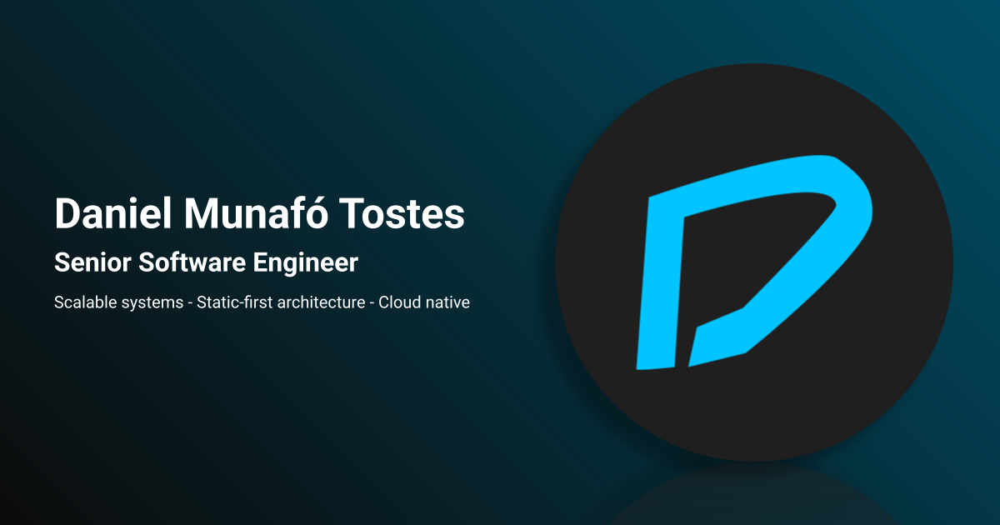

# [danieltostes.com](https://danieltostes.com)

[](https://github.com/danielmunafo/danieltostes.com/actions/workflows/ci.yml?query=branch%3Amain) [](https://danieltostes.com)



## Live

🌍 **Production:** https://danieltostes.com  
🔧 **Preview:** https://dev.danieltostes.com

Personal portfolio for **Daniel Munafó Tostes** — Senior Software Engineer (scalable product platforms, distributed systems, cloud-native). Static-first, production-grade site on **AWS S3 + CloudFront**, CI/CD via GitHub Actions.

---

## Architecture (summary)

- **Stack:** Next.js 16 (App Router), TypeScript, static export (`output: 'export'`)
- **Hosting:** S3, CloudFront, Route 53
- **UI:** MUI + Emotion, theme-driven, dark/light, Roboto
- **i18n:** next-intl, 4 locales (en, pt-BR, es, it), locale in path, on-demand message chunks
- **Quality:** Vitest (unit), Playwright (E2E), ESLint, Prettier; Husky pre-commit (lint-staged) and pre-push (format check + lint + unit tests)

No runtime server; no API routes. Built once, served via CDN.

**Details:** [docs/architecture.md](docs/architecture.md), [docs/diagrams.md](docs/diagrams.md), [docs/design-principles.md](docs/design-principles.md).

---

## Development

```bash
npm install
npm run dev      # http://localhost:3000
npm run build    # static export → out/
npm start        # serve out/ (preview)
```

Other: `npm run lint`, `npm run format:check`, `npm run test`, `npm run test:e2e`.  
Pre-push runs format check, lint, and unit tests. Full workflow: [docs/development.md](docs/development.md).

**When starting a change:** 1) Read [AGENTS.md](AGENTS.md). 2) Find the relevant rule in [.cursor/AI_INDEX.md](.cursor/AI_INDEX.md). 3) Make your change. 4) Run checks (pre-push runs format check, lint, test). 5) Do the pre-completion review (see [AGENTS.md](AGENTS.md) and [.cursor/rules/code-review.mdc](.cursor/rules/code-review.mdc)).

---

## CI/CD

PRs: lint, format, unit tests, build, E2E → deploy to **dev**.  
Merge to `main`: same checks → deploy to **production**.

Setup and secrets: [docs/deployment-setup.md](docs/deployment-setup.md).

---

## Docs

See [docs/README.md](docs/README.md) for the full documentation index.

**AI / Cursor:** [AGENTS.md](AGENTS.md) for stack and style; [.cursor/AI_INDEX.md](.cursor/AI_INDEX.md) for scoped rules and skills.

---

## License

Repository is public for transparency and learning. Content and branding remain the intellectual property of Daniel Munafó Tostes.

---

## Contact

**CV:** On the live site  
**LinkedIn:** [Daniel Tostes](https://www.linkedin.com/in/dantostes/)  
**Email:** dann.tostes@gmail.com
