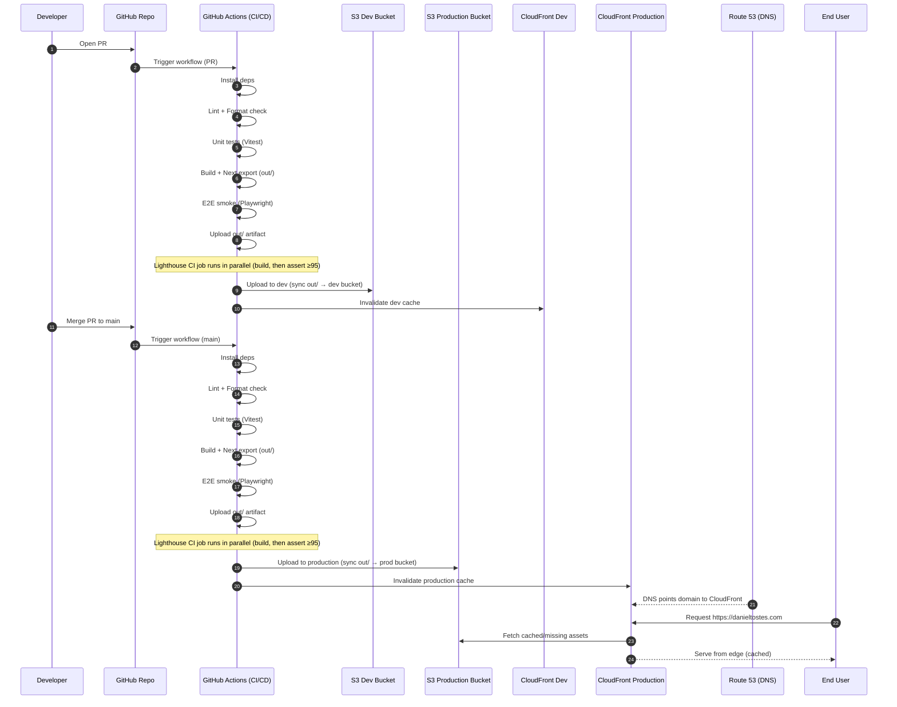
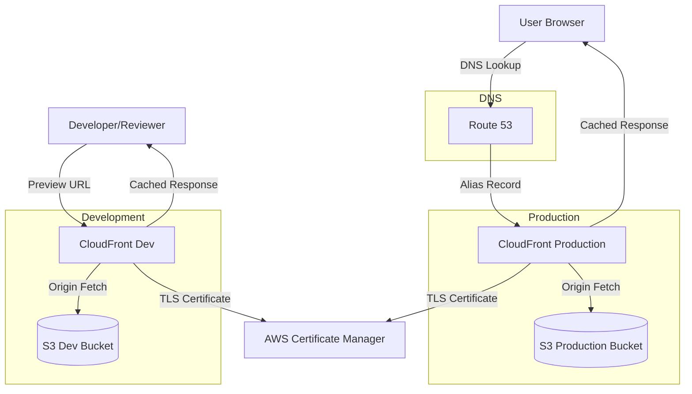

# Diagrams

## 1) CI/CD Deployment (GitHub Actions → AWS)

## 2) S3 + CloudFront + Route 53 (Multi-Environment)

### Deployment Environments

**Production**

- Deployed on merge to `main`
- Custom domain via Route 53
- Production S3 bucket and CloudFront distribution

**Development**

- Deployed on pull requests
- Preview URL for testing before merge
- Separate dev S3 bucket and CloudFront distribution

### Benefits by component

**S3 (Static hosting bucket)**
• Extremely durable object storage for static assets.
• Simple deployment model: upload out/ and you're done.
• Low cost and minimal operational complexity.
• Isolated buckets per environment for safe testing.

**CloudFront (CDN)**
• Caches content close to users (faster worldwide).
• HTTPS termination at the edge.
• Better security posture (can add WAF later if needed).
• Handles SPA routing patterns (with the right error/redirect config).
• Separate distributions per environment for independent cache control.

**Route 53 (DNS)**
• Reliable DNS hosting for the custom domain.
• Alias records integrate cleanly with CloudFront.
• Easy management of subdomains (e.g., www, api, static).
• Production domain points to production CloudFront only.

**ACM (Certificate Manager)**
• Managed TLS certificates for HTTPS (typically used by CloudFront).
• Auto-renewal.
• Used by both dev and production distributions.
