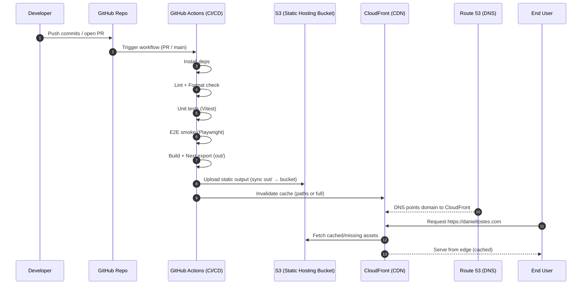

# Diagrams

## 1) CI/CD Deployment (GitHub Actions → AWS)

## 2) S3 + CloudFront + Route 53

flowchart LR
U[User Browser] -->|DNS lookup| R53[Route 53 Hosted Zone]
R53 -->|A/AAAA Alias| CF[CloudFront Distribution]
CF -->|Origin fetch (cache miss)| S3[(S3 Bucket: static site)]
CF -->|Edge cache (cache hit)| U

CF -.->|TLS cert (ACM)| ACM[AWS Certificate Manager]
CF -.->|Logs (optional)| LOGS[(S3 Logs Bucket)]

Benefits by component

S3 (Static hosting bucket)
• Extremely durable object storage for static assets.
• Simple deployment model: upload out/ and you’re done.
• Low cost and minimal operational complexity.

CloudFront (CDN)
• Caches content close to users (faster worldwide).
• HTTPS termination at the edge.
• Better security posture (can add WAF later if needed).
• Handles SPA routing patterns (with the right error/redirect config).

Route 53 (DNS)
• Reliable DNS hosting for the custom domain.
• Alias records integrate cleanly with CloudFront.
• Easy management of subdomains (e.g., www, api, static).

ACM (Certificate Manager)
• Managed TLS certificates for HTTPS (typically used by CloudFront).
• Auto-renewal.
