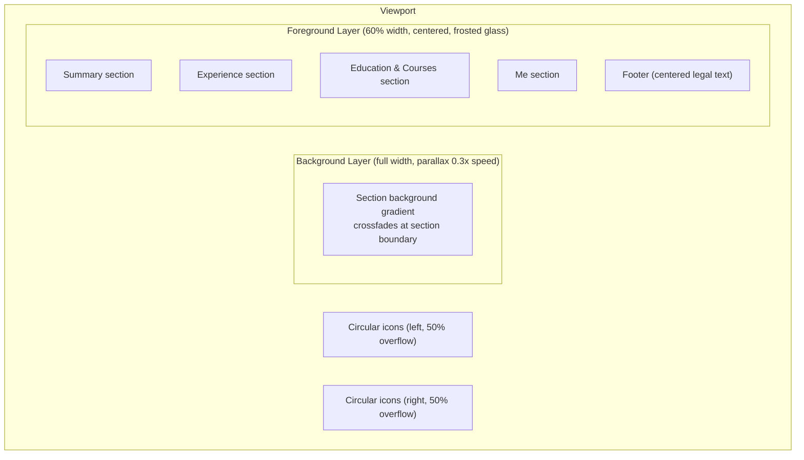
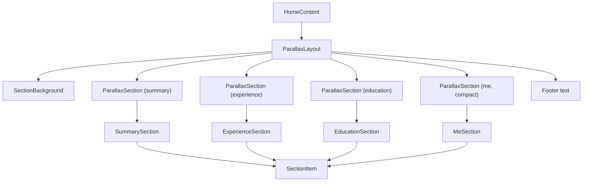
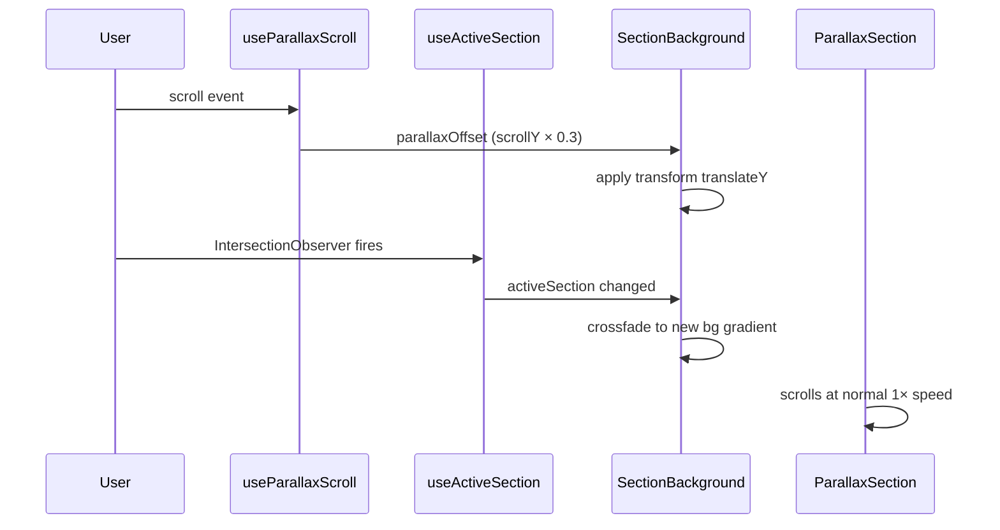

# Parallax Two-Plane Scrolling Sections

## Overview

The page uses two visual layers to create a parallax scrolling CV/portfolio with four content sections, full i18n support (en, pt-BR, es, it), dark/light theming with glassmorphism, company logos, and responsive layout.

- **Background layer**: Fixed position, full viewport. Shows a CSS gradient per section (dark and light variants). Moves at 30% scroll speed (parallax). Crossfades between gradients at section boundaries.
- **Foreground layer**: 60% width centered column with a **frosted-glass** effect — semi-transparent section color (`alpha: 0.7`) + `backdrop-filter: blur(20px)`. Scrolls at normal speed. Rounded corners and a subtle border enhance the glass edge.
- **Circular icons**: One per titled content block (where applicable), positioned 50% inside / 50% outside the content column, alternating left/right per item. Each icon has a thin solid border matching the section color. Background matches TopBar color (black/white) for transparent SVGs. Hidden on mobile. Icons without `iconSrc` are not rendered and have no extra side padding.
- **Icon scaling**: Icons support an optional `iconScale` multiplier. Upscaled icons (>1) zoom the image while maintaining `cover` fit. Downscaled icons (<1) switch to `contain` fit with inner padding to show the full image without cropping.
- **Footer**: Centered legal line at the bottom of the page.
- **Responsive**: On mobile (`xs`/`sm`), the content column stretches to 92% and icons are hidden.

## Theming

Both dark and light themes are fully supported (default: dark):

| Section    | Dark Color | Light Color | Notes        |
| ---------- | ---------- | ----------- | ------------ |
| Summary    | `#0D1B2A`  | `#C9D6E3`   | Navy / Steel |
| Experience | `#1B4332`  | `#C9E3D4`   | Green / Sage |
| Education  | `#4A1942`  | `#D9C9E3`   | Purple / Lav |
| Me         | `#6B2737`  | `#E3C9D1`   | Burg / Rose  |

- **Text**: `theme.palette.text.primary` — white in dark mode, black in light mode.
- **Chips**: `rgba(255,255,255,0.15)` (dark) / `rgba(0,0,0,0.08)` (light) via `CHIP_BG` constant.
- **Dividers**: Use MUI's theme-aware `"divider"` color, with `my: 4` (32px) vertical margin matching horizontal content padding.
- **TopBar**: Frosted glass — `rgba(0,0,0,0.75)` / `rgba(255,255,255,0.75)` with `blur(20px)` and a subtle shadow. Sticky position ensures it stays above the parallax layers.
- **Locale dropdown**: Same frosted glass effect as TopBar (semi-transparent bg + blur + border).
- **Icon backgrounds**: Match TopBar bg color (`#000000` dark / `#ffffff` light) so transparent SVGs render cleanly.

Background gradients also have dark/light variants per section.

## Icons & Images

### Experience section (company logos)

| Role                      | Icon                | Scale |
| ------------------------- | ------------------- | ----- |
| Personal Fitness Platform | `/potenzo.svg`      | —     |
| Ageras (Kontist)          | `/ageras.svg`       | —     |
| Klarna                    | `/klarna.svg`       | 1.05  |
| MercadoLivre              | `/mercadolivre.svg` | —     |
| Itaú Unibanco             | `/itau.svg`         | 1.2   |
| PagSeguro PagBank         | `/pagseguro.svg`    | —     |
| Five Validation           | `/five.png`         | 0.5   |

### Other sections

| Section item                   | Icon        | Notes                     |
| ------------------------------ | ----------- | ------------------------- |
| Summary (description + skills) | `/logo.svg` | Also used as site favicon |
| Summary (Selected Impact)      | _none_      |                           |
| Education (degrees)            | `/cps.png`  |                           |
| Education (courses)            | `/aws.svg`  | Scale 0.5                 |
| Education (languages)          | _none_      |                           |
| Education (work permits)       | _none_      |                           |
| About Me                       | `/me.jpeg`  |                           |

## Architecture

### Files

| File                                            | Purpose                                                                                                                                               |
| ----------------------------------------------- | ----------------------------------------------------------------------------------------------------------------------------------------------------- |
| `src/constants/sections.ts`                     | Section IDs, colors (dark/light), gradients (dark/light), glass params, chip backgrounds, icon sizing, layout constants, experience role icon configs |
| `src/hooks/useParallaxScroll.ts`                | `requestAnimationFrame`-based scroll tracker returning a parallax offset                                                                              |
| `src/hooks/useActiveSection.ts`                 | `IntersectionObserver` hook detecting the current section in viewport                                                                                 |
| `src/components/sections/ParallaxLayout.tsx`    | Orchestrator: background layer + section columns + footer                                                                                             |
| `src/components/sections/SectionBackground.tsx` | Fixed background with crossfade + parallax transform, theme-aware gradients                                                                           |
| `src/components/sections/ParallaxSection.tsx`   | Section wrapper: frosted-glass content column with theme-aware color; `compact` prop for last section (no `100vh` minimum)                            |
| `src/components/sections/SectionItem.tsx`       | Content block wrapper: optional circular icon (50/50 overlap) with scale support, alternating sides, min height, padding calculations                 |
| `src/components/sections/SummarySection.tsx`    | Summary: description, skill chips, selected impacts                                                                                                   |
| `src/components/sections/ExperienceSection.tsx` | Experience: roles with company logos and tech chips                                                                                                   |
| `src/components/sections/EducationSection.tsx`  | Education: degrees, courses, languages, work permits                                                                                                  |
| `src/components/sections/MeSection.tsx`         | About Me with profile photo                                                                                                                           |

### Modified files

| File                                    | Change                                                                |
| --------------------------------------- | --------------------------------------------------------------------- |
| `src/components/HomeContent.tsx`        | Replaced original content with `<ParallaxLayout />`                   |
| `src/components/TopBar.tsx`             | Frosted-glass styling, sticky position, theme-aware bg/shadow         |
| `src/components/LocaleSwitcher.tsx`     | Frosted-glass dropdown menu                                           |
| `src/contexts/LocaleRuntimeContext.tsx` | Default theme → dark; URL updates on locale switch via `replaceState` |
| `src/contexts/ThemeModeContext.tsx`     | Default theme changed to dark                                         |
| `src/app/layout.tsx`                    | Added `/logo.svg` as site favicon                                     |
| `src/theme/index.ts`                    | Added `h3`, `h4`, `subtitle1` typography variants                     |
| `src/messages/{en,pt-BR,es,it}.json`    | Full translated content for all 4 sections                            |
| `e2e/smoke.spec.ts`                     | Updated for new page structure (sections, footer, scoped selectors)   |

### Test files

| File                                                 | Tests                                                              |
| ---------------------------------------------------- | ------------------------------------------------------------------ |
| `src/constants/sections.test.ts`                     | 17 — hexToRgba, getItemSide, color maps, layout constants          |
| `src/hooks/useParallaxScroll.test.ts`                | 3 — offset calculation with mocked scroll                          |
| `src/hooks/useActiveSection.test.ts`                 | 5 — default section, observer, intersection updates                |
| `src/components/TopBar.test.tsx`                     | 3 — author name, controls, both themes                             |
| `src/components/sections/SummarySection.test.tsx`    | 5 — title, description, skills, impacts                            |
| `src/components/sections/ExperienceSection.test.tsx` | 4 — title, companies, positions, tech chips                        |
| `src/components/sections/EducationSection.test.tsx`  | 6 — title, degrees, courses, languages, permits                    |
| `src/components/sections/MeSection.test.tsx`         | 2 — title, placeholder                                             |
| `src/test/render.tsx`                                | Test utility: `renderWithProviders` with MUI theme + next-intl     |
| `e2e/smoke.spec.ts`                                  | 6 — page load, sections, top bar, locale switch, footer, companies |

### No external dependencies

All effects implemented with browser APIs:

- `requestAnimationFrame` + `window.scrollY` for parallax offset
- `IntersectionObserver` for section boundary detection
- CSS `transition` on `opacity` for background crossfade
- CSS `backdrop-filter: blur()` for glassmorphism
- `window.history.replaceState` for locale URL sync
- MUI `sx`, `styled()`, and `useTheme()` for all styling

### Component hierarchy

### Layout constants

| Constant                      | Value   | Purpose                            |
| ----------------------------- | ------- | ---------------------------------- |
| `CONTENT_COLUMN_WIDTH`        | `60%`   | Desktop content column             |
| `CONTENT_COLUMN_WIDTH_MOBILE` | `92%`   | Mobile content column              |
| `CONTENT_COLUMN_PADDING_X`    | `32px`  | Horizontal padding inside column   |
| `SECTION_ICON_SIZE`           | `160px` | Icon diameter                      |
| `SECTION_ICON_OVERLAP_RATIO`  | `0.5`   | 50% of icon overlaps inside column |
| `SECTION_ITEM_MIN_HEIGHT`     | `400px` | 2.5× icon size                     |
| `SECTION_ITEM_PADDING_Y`      | `32px`  | Vertical padding per item          |
| `GLASS_BLUR`                  | `20px`  | Backdrop blur radius               |
| `GLASS_ALPHA`                 | `0.7`   | Section background opacity         |
| `PARALLAX_FACTOR`             | `0.3`   | Background scroll speed multiplier |

### Parallax mechanics

