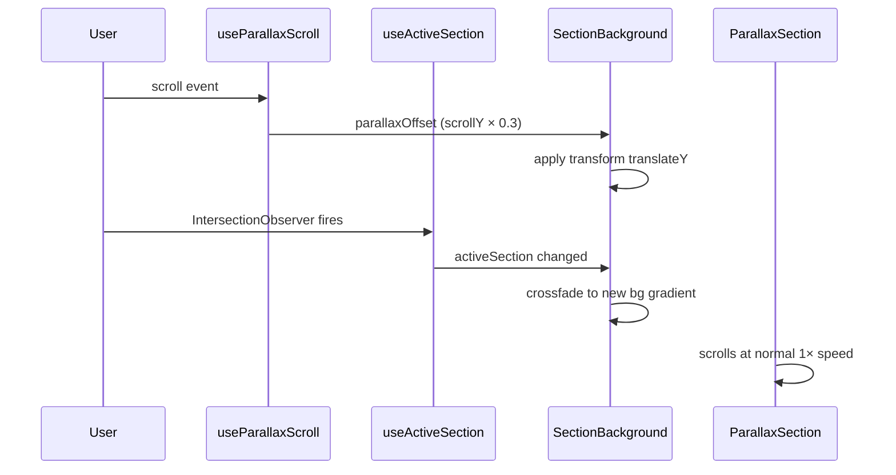

# Parallax Two-Plane Scrolling Sections

## Overview

The page uses two visual layers to create a parallax scrolling CV/portfolio with four content sections, full i18n support (en, pt-BR, es, it), dark/light theming with glassmorphism, company logos, and responsive layout.

- **Background layer**: Fixed position, full viewport. Shows a CSS gradient per section (dark and light variants). Moves at 30% scroll speed (parallax). Crossfades between gradients at section boundaries.
- **Foreground layer**: 60% width centered column with a **frosted-glass** effect — semi-transparent section color (`alpha: 0.7`) + `backdrop-filter: blur(20px)`. Scrolls at normal speed. Rounded corners and a subtle border enhance the glass edge.
- **Circular icons**: One per titled content block (where applicable), positioned 50% inside / 50% outside the content column, alternating left/right per item. Each icon has a thin solid border matching the section color. Background matches TopBar color (black/white) for transparent SVGs. Hidden on mobile. Icons without `iconSrc` are not rendered and have no extra side padding.
- **Icon scaling**: Icons support an optional `iconScale` multiplier. Upscaled icons (>1) zoom the image while maintaining `cover` fit. Downscaled icons (<1) switch to `contain` fit with inner padding to show the full image without cropping.
- **Footer**: Centered legal line at the bottom of the page.
- **Responsive**: On mobile (below `md` breakpoint):
  - Content column stretches to 92% width
  - Icons are hidden and their extra side-padding is removed
  - All padding, margins, and divider spacing are halved (e.g. 32px → 16px, `spacing(8)` → `spacing(4)`)
  - `SectionItem` minimum height drops to `auto` (no icon-based constraint)
  - Parallax transform is fully disabled (background is static) — eliminates scroll jank and repainting
  - `willChange` is reduced to `opacity` only (no GPU layer promotion for transform)

## Theming

Both dark and light themes are fully supported (default: dark):
Background gradients also have dark/light variants per section.

## Architecture

### No external dependencies

All effects implemented with browser APIs:

- `requestAnimationFrame` + `window.scrollY` for parallax offset
- `IntersectionObserver` for section boundary detection
- CSS `transition` on `opacity` for background crossfade
- CSS `backdrop-filter: blur()` for glassmorphism
- `window.history.replaceState` for locale URL sync
- MUI `sx`, `styled()`, and `useTheme()` for all styling

### Parallax mechanics

