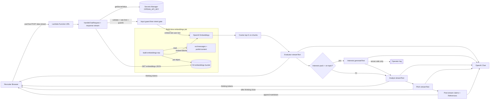

# Recruiter AI Assistant — Execution Plan

**Status:** Implemented (see repo). **Last updated:** 2026-05-14.

This document is the canonical reference for the recruiter-facing AI chat: architecture, security, AWS setup (no Terraform), CI, and repo layout. Future agents: start here, then [services/recruiter-assistant-api/SETUP.md](../../services/recruiter-assistant-api/SETUP.md) for AWS CLI steps.

---

## Locked decisions

- **Model & SDK:** OpenAI **`gpt-5.4-mini`** (chat; `CHAT_MODEL` in `services/recruiter-assistant-api/src/constants.ts`) + **`text-embedding-3-small`** (embeddings) via the [Vercel AI SDK](https://sdk.vercel.ai/) (`ai`, `@ai-sdk/openai`). The site’s React chat uses `@ai-sdk/react` / `useChat`; the Lambda handler uses `streamText` (evaluator, analyst, pitch), optional `generateText` (interests evaluator only), `embed`, `createDataStreamResponse`, and (post-stream) `generateObject` for reference claim extraction.
- **Repo layout:** Monorepo subdir at `services/recruiter-assistant-api/` with its own `package.json`, `tsconfig.json`, tests, runbook, and GitHub Actions workflow. The marketing site remains **static export** (S3/CloudFront).
- **No Terraform.** Rarely changing AWS resources use a manual runbook + `aws` CLI in CI.
- **Vector store:** Flat JSON in a private S3 bucket; cosine top-K in Lambda. No managed vector DB.
- **Streaming transport:** Lambda **Function URL** with **response streaming** (`InvokeMode = RESPONSE_STREAM`). No API Gateway in v1.

---

## Architecture

- **Local dev:** `npm run dev` in `services/recruiter-assistant-api` runs `scripts/dev-server.mjs` (HTTP wrapper). The Next app uses `NEXT_PUBLIC_RECRUITER_API_URL` (e.g. `http://127.0.0.1:3001`). `.env` / `.env.local` can supply `OPENAI_API_KEY` and optional `EMBEDDINGS_JSON_PATH` for a local embeddings file.

### Request handler (`handler.ts`) — runtime flow

1. **HTTP surface:** `OPTIONS` → `204` with CORS headers. Only `POST` is accepted for chat (`405` otherwise). Parse JSON body (`messages` array required).
2. **CORS:** `ALLOWED_ORIGIN` may be a comma-separated allowlist. If non-empty, requests without a matching `Origin` get `403` `forbidden_origin` **without** CORS headers on the error body. If empty/unset, permissive behavior for local dev (handler reflects `Origin` or `*` per `corsHeadersFor`).
3. **Abuse controls:** In-memory token-bucket **rate limit** per client IP (`checkRateLimit`) → `429` `rate_limited` with CORS on the JSON error.
4. **Trust boundary — last user text:** `getLastUserText` → `runInputGuard` (length, control chars, injection-ish phrases) → `400` with a stable `error` reason if blocked.
5. **Message shape:** `convertToCoreMessages` for the full thread; malformed UI messages → `400` `invalid_message_shape`.
6. **Intent gate:** `runIntentGate` (small bounded chat completion: recruiter-relevant vs off-topic) **after** input guard, **before** any RAG/embeddings work → `400` with reason if off-topic.
7. **Streaming response:** `createDataStreamResponse` (AI SDK) with Lambda **response streaming** when `globalThis.awslambda` is present (`streamifyResponse` + `HttpResponseStream.from` copying `Response.body` chunks to the Node writable). On uncaught errors while building the `Response`, the streamify path returns `500` JSON `{ error: "internal", message }`.
8. **Inside the stream (ordered):**
   - Emit **thinking markers** (`[[THINKING_START]]` / `[[THINKING_END]]` from `constants.ts`) so the UI can show internal reasoning as collapsible “thinking.”
   - **RAG (before thinking content):** `embed` the guarded user text → `retrieveTopK` (cosine, `RAG_TOP_K`, default **30** in `constants.ts`) over chunks from `loadEmbeddingsFile()` → `formatPortfolioChunks` (localized `### Source` / `### Fonte` / … headers).
   - **Evidence evaluator (first thinking segment):** `streamText` with `buildEvidenceEvaluatorSystemPrompt` / `buildEvidenceEvaluatorUserPrompt` (JD + excerpts). Merged into the data stream with `experimental_sendFinish: false` so tokens stream to the client for better perceived time-to-first-token; the handler **awaits** `evaluatorResult.text` before the next thinking segment. The evaluator owns **requirement coverage** (must-have / nice-to-have, direct / adjacent / not evidenced / contradictory), **misleading-similarity warnings**, and **`# Match Score Guidance`** including **hard score caps** (see `EVIDENCE_EVALUATOR_HARD_CAP_RULES_EN` in `src/rag/evaluatorPrompt.ts`).
   - **Interests evaluator (optional, after evaluator text is known):** When `loadInterestsPack()` returns a valid pack and the evaluator output is not the localized off-topic brief, the handler runs `generateText` with `buildInterestsEvaluatorSystemPrompt` / `buildInterestsEvaluatorUserPrompt` (JD + private `criteriaMarkdown`). Output is skipped when empty or `[[INTERESTS_SKIP]]`. **Not** merged into the data stream, the analyst user turn, or the pitch brief; the handler logs non-empty output server-side under `[recruiter-interests-not-in-response]` for operator review. Privacy: prompts forbid quoting private thresholds verbatim.
   - **Evidence analyst (next thinking segment):** After a markdown `---` separator, `streamText` with `buildEvidenceAnalystSystemPrompt` / `buildEvidenceAnalystUserPrompt` (injects **evaluator** markdown only as authoritative). Synthesis sections only — **no duplicate requirement table**. Merged with `experimental_sendFinish: false`; the handler **awaits** `briefResult.text`, then emits `[[THINKING_END]]`.
   - **Recruiter pitch:** `streamText` with `buildRecruiterPitchSystemPrompt` on a composed brief (evaluator + analyst, separated by `---`), same `sourceExcerpts`, and `messages: coreMessages`, merged with `experimental_sendStart: false`. The pitch follows **Technical fit** from the evaluator (score ceiling) and must **not** surface private preference scores or headings from the interests stage.
   - **Post-stream — References:** `buildReferencesMarkdown` runs after `pitchResult.text` is available: structured **claim extraction** (`generateObject` + Zod schema), **embed** claims, cosine-match against the same embedding index, emit a `## References` markdown block (with an explicit “lacking vector match” flag per claim under threshold). Appended as plain text parts to the same stream **after** the pitch finishes (not token-interleaved with stage 2).

**Latency note:** Wall-clock time until the analyst begins includes the full evaluator generation; streaming the evaluator only improves **perceived** time-to-first-token inside the thinking panel, not total pipeline duration.

---

## Repository layout

- **`services/recruiter-assistant-api/`** — Lambda bundle, RAG, security helpers, embeddings build script, `SETUP.md`, Vitest tests.
- **`src/features/recruiter-assistant/`** — `ChatHero`, `RecruiterChat`, `useChatFade`, constants, API URL helper.
- **`src/components/HomeContent.tsx`** — Composes `ChatHero` above `ParallaxLayout`.
- **`src/constants/sections.ts`** — `SECTION_IDS` includes `assistant` first for background crossfade; `PARALLAX_SECTION_IDS` lists scrollable CV sections only (no duplicate assistant column).
- **`docs/plans/recruiter-assistant-plan.md`** — This file.
- **`.cursor/rules/recruiter-assistant.mdc`** — Short pointer + conventions for agents.

---

## Frontend UX

- Landing: centered chat in a full-viewport hero; scrolling reveals the existing parallax CV below.
- Background layer uses the `assistant` gradient while the viewport center is in the hero; then transitions per existing section logic.
- **Stream UX:** The client splits the **thinking** phase using `THINKING_OPEN_MARKER` / `THINKING_CLOSE_MARKER` from the API package (`constants.ts`). Inside thinking, the **evaluator** streams first (requirement coverage + match score guidance), then `---`, then **analyst** synthesis — rendered in the same collapsible panel. (Optional interests evaluation runs server-side only; it is not part of the streamed thinking body.) Trailing `## References` content is surfaced for evidence review when present.

---

## Security (v1)

- **Input:** max length, strip control characters, blocklist for common prompt-injection phrases (`runInputGuard`); failures return `400` JSON errors (no stream).
- **Intent gate:** lightweight LLM classification on guarded text (`runIntentGate`) before embeddings/RAG; off-topic → `400` JSON (saves cost and reduces misuse surface).
- **Rate limit:** in-memory per-Lambda-instance token bucket per client IP; bounded further by Lambda **reserved concurrency** (see `SETUP.md`).
- **Scope:** system instructions restrict answers to the supplied portfolio context; refuse unrelated requests (enforced in prompts + intent gate + off-topic handling in references builder).
- **CORS:** Prefer comma-separated **`ALLOWED_ORIGIN`** in production. When unset/empty, dev-friendly reflection / `*` behavior — **do not** rely on that in prod.
- **Secrets:** OpenAI key in AWS Secrets Manager in production; Lambda execution role reads `OPENAI_SECRET_ARN`.

---

## AWS enablement (manual)

See **[services/recruiter-assistant-api/SETUP.md](../../services/recruiter-assistant-api/SETUP.md)** for numbered steps: embeddings bucket, log group, execution role, secret, Lambda + Function URL, GitHub OIDC deploy role, `AWS_RECRUITER_API_ROLE_ARN` + `RECRUITER_API_URL` / `NEXT_PUBLIC_RECRUITER_API_URL`.

---

## CI

- **`.github/workflows/recruiter-api.yml`** — On changes under `services/recruiter-assistant-api/**`: test, bundle, `aws lambda update-function-code` on `main` (OIDC). Embeddings refresh job (manual + path filters) uploads a new JSON to S3 and updates Lambda env `EMBEDDINGS_S3_URI` / `EMBEDDINGS_S3_KEY` as documented in `SETUP.md`.
- **Site `ci.yml`** — Unchanged for static deploy; set `NEXT_PUBLIC_RECRUITER_API_URL` from a repo/org variable when the Function URL exists.

---

## Verification

- Root: `npm run format:check`, `npm run lint`, `npm run test`, `npm run build`, `npm run test:e2e`.
- Service: `cd services/recruiter-assistant-api && npm test`.

---

## Out of scope (v1)

- User accounts / persisted chat history.
- WAF / Turnstile (documented as future hardening).

---

## References

- [docs/architecture.md](../architecture.md) — Static-first goals; assistant as optional compute.
- [docs/diagrams.md](../diagrams.md) — Assistant data-flow diagram.
- [AGENTS.md](../../AGENTS.md) — Stack and review checklist.
