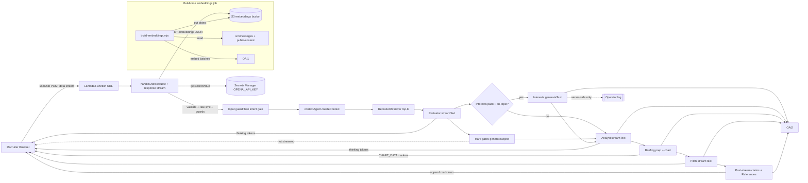

# Recruiter AI Assistant — Execution Plan

**Status:** Implemented (see repo). **Last updated:** 2026-05-17.

This document is the canonical reference for the recruiter-facing AI chat: architecture, security, AWS setup (no Terraform), CI, and repo layout. Future agents: start here, then [services/recruiter-assistant-api/SETUP.md](../../services/recruiter-assistant-api/SETUP.md) for AWS CLI steps.

---

## Locked decisions

- **Model & SDK:** OpenAI **`gpt-4.1-nano`** (chat default in code; override on each Lambda with env `RECRUITER_CHAT_MODEL` in AWS — `CHAT_MODEL` in `services/recruiter-assistant-api/src/constants.ts`) + **`text-embedding-3-small`** (embeddings) via the [Vercel AI SDK](https://sdk.vercel.ai/) (`ai`, `@ai-sdk/openai`). The site’s React chat uses `@ai-sdk/react` / `useChat`; the Lambda handler uses `streamText` (evaluator, analyst, pitch), optional `generateText` (interests evaluator only), `embed`, `createDataStreamResponse`, and (post-stream) `generateObject` for reference claim extraction.
- **Repo layout:** Monorepo subdir at `services/recruiter-assistant-api/` with its own `package.json`, `tsconfig.json`, tests, runbook, and GitHub Actions workflow. The marketing site remains **static export** (S3/CloudFront).
- **No Terraform.** Rarely changing AWS resources use a manual runbook + `aws` CLI in CI.
- **Vector store:** Flat JSON in a private S3 bucket (`embeddings.json`). Retrieval is behind `RecruiterRetriever` in `src/retrieval/` — default **`custom`** (cosine top-K); optional **LlamaIndex** (`llamaindex-hydrated` / `llamaindex-native`) via `RECRUITER_RETRIEVER_PROVIDER`. No managed vector DB (Pinecone/pgvector).
- **Streaming transport:** Lambda **Function URL** with **response streaming** (`InvokeMode = RESPONSE_STREAM`). No API Gateway in v1.

---

## Architecture

- **Local dev:** `npm run dev` in `services/recruiter-assistant-api` runs `scripts/dev-server.mjs` (HTTP wrapper). The Next app uses `NEXT_PUBLIC_RECRUITER_API_URL` (e.g. `http://127.0.0.1:3001`). `.env` / `.env.local` can supply `OPENAI_API_KEY` and optional `EMBEDDINGS_JSON_PATH` for a local embeddings file.

### Request path — HTTP then pipeline

**HTTP** (`handleChatRequest.ts`, validation in `parseAndValidateRecruiterRequest.ts`):

1. **HTTP surface:** `OPTIONS` → `204` with CORS headers. Only `POST` is accepted for chat (`405` otherwise). Parse JSON body (`messages` array required).
2. **CORS:** `ALLOWED_ORIGIN` may be a comma-separated allowlist. If non-empty, requests without a matching `Origin` get `403` `forbidden_origin` **without** CORS headers on the error body. If empty/unset, permissive behavior for local dev (handler reflects `Origin` or `*` per `corsHeadersFor`).
3. **Abuse controls:** In-memory token-bucket **rate limit** per client IP (`checkRateLimit`) → `429` `rate_limited` with CORS on the JSON error.
4. **Trust boundary — last user text:** `getLastUserText` → `runInputGuard` (length, control chars, injection-ish phrases) → `400` with a stable `error` reason if blocked.
5. **Message shape:** `convertToCoreMessages` for the full thread; malformed UI messages → `400` `invalid_message_shape`.
6. **Optional reCAPTCHA:** when `RECAPTCHA_SECRET_KEY` is set, require valid `recaptchaToken` → `403 captcha_failed` if missing/invalid.
7. **Intent gate:** `runIntentGate` (small bounded chat completion: recruiter-relevant vs off-topic) **after** input guard, **before** any RAG/embeddings work → `400` with reason if off-topic.
8. **Streaming response:** `createRecruiterAssistantStreamResponse` → `createDataStreamResponse` (AI SDK) with Lambda **response streaming** when `globalThis.awslambda` is present (`streamifyResponse` + `HttpResponseStream.from`). On uncaught errors while building the `Response`, the streamify path returns `500` JSON `{ error: "internal", message }`.

**Inside the stream** (`runRecruiterAssistantPipeline.ts`, ordered):

1. **`[[THINKING_START]]`** — UI collapsible “evidence review.”
2. **RAG:** `contextAgent.createContext` — `RecruiterRetriever` (default custom cosine; optional LlamaIndex) → `RAG_TOP_K` **30** → `formatPortfolioChunks`.
3. **Evidence evaluator:** `evidenceEvaluationAgent.evaluateEvidence` (streamed in thinking panel).
4. **Off-topic check:** `recruiterAgent.evaluateOffTopic` on evaluator markdown.
5. **Hard gates (server-only):** `hardGatesAgent.assessHardGates` — caps for pitch/chart; **not** streamed.
6. **Interests (optional):** `interestsAgent.scheduleEvaluation` — server log only when configured.
7. **Evidence analyst:** `evidenceAnalysisAgent.analyzeEvidence` (streamed).
8. **`[[THINKING_END]]`**
9. **Briefing + chart:** `recruiterAgent.projectBriefingAndChart` — `BRIEFING_PREP_*` + `CHART_DATA_*` markers.
10. **Pitch:** `recruiterAgent.generatePitch` with hard-gate clamp.
11. **Chart sync:** `recruiterAgent.syncChartWithPitch` may re-emit chart JSON.
12. **References:** `referencesAgent.generateReferences` — claim extraction + cosine match-back.

**Latency note:** The analyst cannot start until evaluator (and hard-gate extraction) finish; streaming the evaluator only improves **perceived** time-to-first-token inside the thinking panel.

---

## Repository layout

- **`services/recruiter-assistant-api/`** — Lambda bundle, RAG, security helpers, embeddings build script, `SETUP.md`, Vitest tests.
- **`src/features/recruiter-assistant/`** — `ChatHero`, `RecruiterChat`, `useChatFade`, constants, API URL helper.
- **`src/components/HomeContent.tsx`** — Composes `ChatHero` above `ParallaxLayout`.
- **`src/constants/sections.ts`** — `SECTION_IDS` includes `assistant` first for background crossfade; `PARALLAX_SECTION_IDS` lists scrollable CV sections only (no duplicate assistant column).
- **`docs/plans/recruiter-assistant-plan.md`** — This file.
- **`.cursor/rules/recruiter-assistant.mdc`** — Short pointer + conventions for agents.

---

## Frontend UX

- Landing: centered chat in a full-viewport hero; scrolling reveals the existing parallax CV below.
- Background layer uses the `assistant` gradient while the viewport center is in the hero; then transitions per existing section logic.
- **Stream UX:** `split-thinking-from-body.ts` parses `THINKING_*`, `BRIEFING_PREP_*`, and `CHART_DATA_*` (values in `constants.ts`). Thinking panel: **evaluator** → `---` → **analyst**. After thinking closes: ephemeral **briefing prep** line + **match profile** chart JSON, then **pitch** markdown, then optional `## References`. Hard gates and interests are server-only.

---

## Security (v1)

- **Input:** max length, strip control characters, blocklist for common prompt-injection phrases (`runInputGuard`); failures return `400` JSON errors (no stream).
- **Intent gate:** lightweight LLM classification on guarded text (`runIntentGate`) before embeddings/RAG; off-topic → `400` JSON (saves cost and reduces misuse surface).
- **Rate limit:** in-memory per-Lambda-instance token bucket per client IP; bounded further by Lambda **reserved concurrency** (see `SETUP.md`).
- **reCAPTCHA v2:** When `RECAPTCHA_SECRET_KEY` is set on Lambda, every chat POST must include a valid `recaptchaToken` (Google `siteverify`). The terms modal shows a checkbox widget; later submits in the same session use invisible v2. Site key: `NEXT_PUBLIC_RECAPTCHA_SITE_KEY` at Next build time. Omit both keys locally to skip verification and UI.
- **Scope:** system instructions restrict answers to the supplied portfolio context; refuse unrelated requests (enforced in prompts + intent gate + off-topic handling in references builder).
- **CORS:** Comma-separated **`ALLOWED_ORIGIN`** in Lambda env (handler enforces `403 forbidden_origin`). **Function URL CORS** must list the same origins (handler does not emit `Access-Control-*` on Lambda — response streaming). Local `npm run dev` uses handler CORS. When unset/empty on Lambda, all cross-origin calls are denied — **do not** rely on permissive dev behavior in prod.
- **Secrets:** OpenAI key in AWS Secrets Manager in production; Lambda execution role reads `OPENAI_SECRET_ARN`.

---

## AWS enablement (manual)

See **[services/recruiter-assistant-api/SETUP.md](../../services/recruiter-assistant-api/SETUP.md)** for numbered steps: embeddings bucket, log group, execution role, secret, Lambda + Function URL, extend `AWS_ROLE_ARN` IAM policy for recruiter CI, `RECRUITER_API_URL` / `NEXT_PUBLIC_RECRUITER_API_URL`.

---

## CI

- **`.github/workflows/recruiter-api.yml`** — On changes under `services/recruiter-assistant-api/**`: test, bundle, `aws lambda update-function-code` (OIDC; does not change Lambda env). Embeddings job uploads a new JSON to the stable S3 key documented in `SETUP.md`.
- **Site `ci.yml`** — Unchanged for static deploy; set `NEXT_PUBLIC_RECRUITER_API_URL` from a repo/org variable when the Function URL exists.

---

## Verification

- Root: `npm run format:check`, `npm run lint`, `npm run test`, `npm run build`, `npm run test:e2e`.
- Service: `cd services/recruiter-assistant-api && npm test`.

---

## Out of scope (v1)

- User accounts / persisted chat history.
- WAF / Turnstile (documented as future hardening).

---

## References

- [docs/architecture.md](../architecture.md) — Static-first goals; assistant as optional compute.
- [docs/diagrams.md](../diagrams.md) — Assistant data-flow diagram.
- [AGENTS.md](../../AGENTS.md) — Stack and review checklist.
