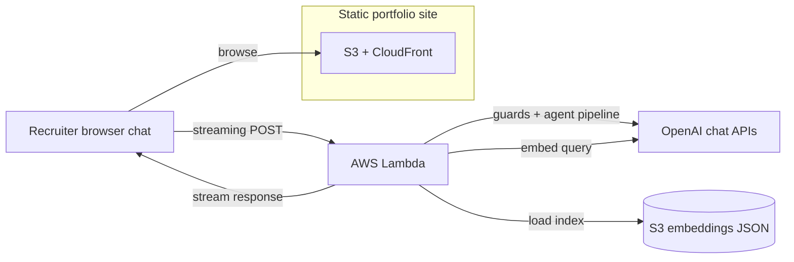
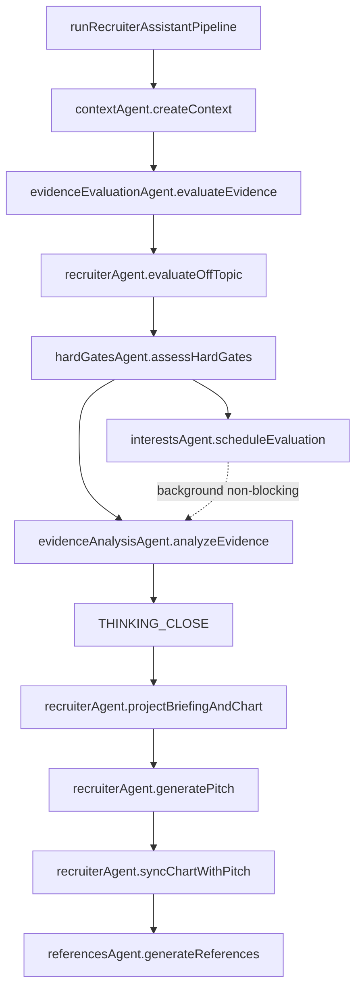

### Plan & scope

Ship a **static-first portfolio** (S3 + CloudFront) that still supports a serious **AI recruiter assistant**: retrieve evidence from public portfolio text, run staged prompts with guardrails, and stream results in the UI—without running a traditional web server for the public site.

### What shipped

- **Site**: Next.js static export, MUI light/dark themes, four-locale i18n, parallax sections, build-time site search, Vitest + Playwright, GitHub Actions CI.
- **Assistant**: browser chat to a small **AWS Lambda** behind a Function URL with **response streaming**; offline embeddings as versioned JSON in S3; cosine top-K RAG, deterministic **input guard** plus **LLM intent gate** before retrieval, in-memory IP rate limits, and CORS allowlist support for production.
- **Agent layer (Lambda)**:
  - Each pipeline stage is a **topic agent** under `services/recruiter-assistant-api/src/recruiterAssistant/agents/`.
  - **Agents:** contextAgent, evidenceEvaluationAgent, hardGatesAgent, interestsAgent, evidenceAnalysisAgent, recruiterAgent, referencesAgent; briefingAgent and chartAgent delegate from recruiterAgent.
  - **Behavior:** colocated `instructions.md` per agent, loaded at bundle time via `getAgentInstruction.ts`; TypeScript assembles locale-aware prompts and enforces schemas.
  - **Orchestration:** `runRecruiterAssistantPipeline.ts` only—no embedded prompt prose.
- **Answer shape (streamed)**:
  - **Thinking** (`THINKING_*`): evidence evaluator (requirement coverage, evidence levels, misleading-similarity callouts, match score guidance with hard caps), then evidence analyst (synthesis only; must not contradict the evaluator).
  - **After thinking closes:** briefing-prep lines (`BRIEFING_PREP_*`), match-profile chart JSON (`CHART_DATA_*`), recruiter-facing pitch (technical fit respects hard-gate ceiling; post-hoc clamp). Optional chart re-emit aligned to pitch scores.
  - **Server-only:** hard-gate assessment; optional private interests evaluation (background—does not block the user-visible stream).
  - **After stream:** structured claim extraction and vector match-back produce optional **References**.
- **Transparency**: in-repo architecture notes, recruiter terms page, evidence-review UI, and written rationales so trade-offs stay reviewable—not only in ephemeral chat.

### Build workflow (AI-generated code)

**Application source code is 100% generated by AI coding agents** (Cursor as the primary harness, Copilot in the review loop). I still own product intent, threat modeling, prompt design, test strategy, CI/CD, and what merges to production—similar to reviewing vendor-delivered code, except the “vendor” is the model and the IDE is the integration surface.

### Technical pillars

- Retrieval-grounded answers with explicit post-hoc references; staged generation (**evaluator** → **analyst** → **pitch**) with deterministic hard-gate caps on fit and chart.
- Agent-oriented maintainability: edit behavior in markdown instructions; keep orchestration and contracts in TypeScript.
- Security-minded defaults for untrusted recruiter text (shaping, intent classification, strict system prompts, fail-closed JSON errors before streaming).
- Operational simplicity: static bundle on S3/CloudFront; Lambda for inference; streaming through the Vercel AI SDK with documented secrets and deploy steps.

### Assistant deployment

The portfolio UI still ships as static assets from S3 and CloudFront; streamed chat traffic follows the Lambda path in the diagram.

### Pipeline orchestration (agents)

`runRecruiterAssistantPipeline` calls topic agents in order; it does not implement model logic itself.

### Tech stack

Next.js, React, TypeScript, MUI, OpenAI, Vercel AI SDK, AWS S3, CloudFront, Lambda, Vitest, Playwright, GitHub Actions
