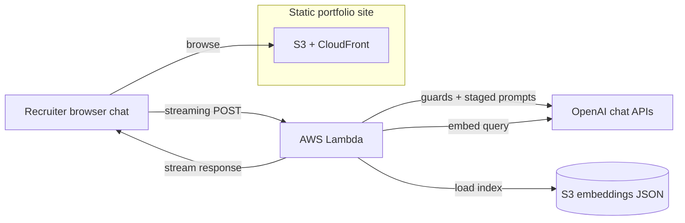

### Plan & scope

Ship a **static-first portfolio** (S3 + CloudFront) that still supports a serious **AI recruiter assistant**: retrieve evidence from public portfolio text, run staged prompts with guardrails, and stream results in the UI—without running a traditional web server for the public site.

### What shipped

- **Site**: Next.js static export, MUI light/dark themes, four-locale i18n, parallax sections, build-time site search, Vitest + Playwright, GitHub Actions CI.
- **Assistant**: browser chat to a small **AWS Lambda** behind a Function URL with **response streaming**; offline embeddings as versioned JSON in S3; cosine top-K RAG, deterministic **input guard** plus **LLM intent gate** before retrieval, in-memory IP rate limits, and CORS allowlist support for production.
- **Answer shape**: **three** streamed chat stages over one data stream—first an **evidence evaluator** (requirement coverage with must-have vs nice-to-have, direct vs adjacent vs not evidenced vs contradictory, misleading-similarity callouts, and **match score guidance** with hard caps so vector similarity cannot inflate fit alone), then an **evidence analyst** (synthesis only, same thinking block, must not contradict the evaluator), then the **recruiter-facing assessment** (match strength respects the evaluator ceiling). ASCII **thinking markers** wrap the evaluator + analyst so the UI can separate internal reasoning from the main reply; after streaming completes, **structured claim extraction** and vector match-back produce an optional **References** block for grounded citations.
- **Transparency**: in-repo architecture notes, recruiter terms page, evidence-review UI, and written rationales so trade-offs stay reviewable—not only in ephemeral chat.

### Build workflow (AI-generated code)

**Application source code is 100% generated by AI coding agents** (Cursor as the primary harness, Copilot in the review loop). I still own product intent, threat modeling, prompt design, test strategy, CI/CD, and what merges to production—similar to reviewing vendor-delivered code, except the “vendor” is the model and the IDE is the integration surface.

### Technical pillars

- Retrieval-grounded answers with explicit post-hoc references; staged generation (**evaluator** requirement coverage + caps, **analyst** synthesis, **pitch** recruiter voice) plus similarity-checked citations.
- Security-minded defaults for untrusted recruiter text (shaping, intent classification, strict system prompts, fail-closed JSON errors before streaming).
- Operational simplicity: static bundle on S3/CloudFront; Lambda for inference; streaming through the Vercel AI SDK (streamText and the data-stream response shape) with documented secrets and deploy steps.

### Assistant architecture

The portfolio UI still ships as static assets from S3 and CloudFront; streamed chat traffic follows the Lambda path in the diagram.

### Tech stack

Next.js, React, TypeScript, MUI, OpenAI, Vercel AI SDK, AWS S3, CloudFront, Lambda, Vitest, Playwright, GitHub Actions
