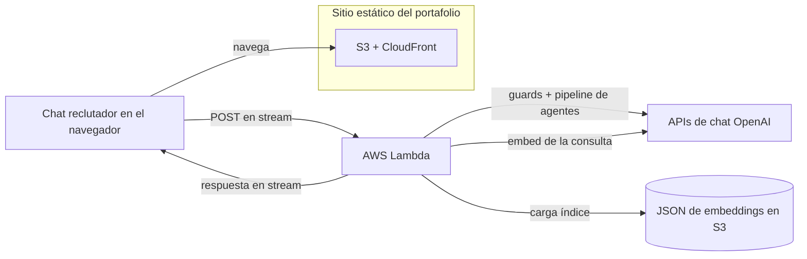
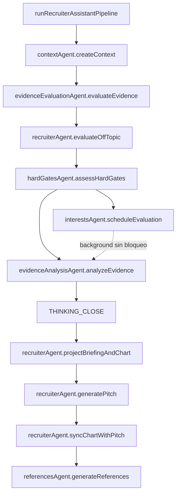

### Plan y alcance

Entregar un **portafolio static-first** (S3 + CloudFront) que aun así soporte un **asistente de reclutamiento con IA** serio: recuperar evidencia del texto público del portafolio, ejecutar prompts por etapas con guardrails y transmitir resultados en la UI—sin un servidor web clásico para el sitio público.

### Qué está en producción

- **Sitio**: export estático de Next.js, temas claro/oscuro MUI, i18n en cuatro idiomas, secciones parallax, búsqueda generada en build, Vitest + Playwright, CI con GitHub Actions.
- **Asistente**: chat en el navegador hacia una pequeña **AWS Lambda** detrás de una Function URL con **streaming de respuesta**; embeddings offline como JSON versionado en S3; RAG por coseno top-K, **input guard** determinístico e **intent gate** por LLM antes de la recuperación, rate limit en memoria por IP y CORS con lista permitida para producción.
- **Capa de agentes (Lambda)**: cada etapa del pipeline es un **agente por tema** en `services/recruiter-assistant-api/src/recruiterAssistant/agents/` (`contextAgent`, `evidenceEvaluationAgent`, `hardGatesAgent`, `interestsAgent`, `evidenceAnalysisAgent`, `recruiterAgent`, `referencesAgent`, con `briefingAgent` / `chartAgent` delegados dentro de `recruiterAgent`). Las reglas de comportamiento viven en **`instructions.md`** colocalizados, cargados en el bundle vía `getAgentInstruction.ts`; TypeScript ensambla prompts según locale y aplica esquemas. **`runRecruiterAssistantPipeline.ts`** es el único orquestador—no incrusta texto de prompt.
- **Forma de la respuesta (stream)**: dentro de los marcadores **`THINKING_*`**—**evaluador de evidencias** (cobertura de requisitos, niveles de evidencia, avisos de similitud engañosa, guía de puntuación con techos) y **analista** (solo síntesis; no puede contradecir al evaluador). Tras cerrar el thinking: líneas efímeras de **briefing prep** (`BRIEFING_PREP_*`), JSON del **gráfico de perfil** (`CHART_DATA_*`), luego el **pitch para reclutadores** (encaje técnico respeta el techo de hard gates; clamp posterior). Reemisión opcional del gráfico alineada al pitch. **Solo servidor (no se transmite):** evaluación de hard gates, evaluación opcional de **intereses** privados (programada en segundo plano para no bloquear lo visible). Al terminar el stream: extracción estructurada de claims y match vectorial generan **Referencias** opcionales.
- **Transparencia**: notas de arquitectura en el repo, página de términos para reclutadores, UI de revisión de evidencia y textos de racional para que los trade-offs sigan siendo auditables.

### Flujo de construcción (código generado por IA)

**El código fuente de la aplicación es 100% generado por agentes de codificación con IA** (Cursor como harness principal, Copilot en el circuito de revisión). Yo sigo siendo dueño de la intención de producto, modelado de amenazas, diseño de prompts, estrategia de pruebas, CI/CD y de lo que llega a producción—como revisar código entregado por un proveedor, salvo que el “proveedor” es el modelo y la IDE es la superficie de integración.

### Pilares técnicos

- Respuestas ancoradas en recuperación con referencias explícitas a posteriori; generación por etapas (**evaluador** → **analista** → **pitch**) con techos determinísticos de hard gates en encaje y gráfico.
- Mantenimiento orientado a agentes: comportamiento en markdown; orquestación y contratos en TypeScript.
- Defensa en profundidad para texto no confiable de reclutadores (forma de entrada, clasificación de intención, system prompts estrictos, errores JSON fail-closed antes del streaming).
- Simplicidad operativa: bundle estático en S3/CloudFront; Lambda para inferencia; streaming mediante Vercel AI SDK, con secretos y pasos de despliegue documentados.

### Despliegue del asistente

La UI del portafolio sigue sirviéndose como assets estáticos desde S3 y CloudFront; el chat en streaming sigue el camino de Lambda del diagrama.

### Orquestación del pipeline (agentes)

`runRecruiterAssistantPipeline` invoca agentes por tema en orden; no implementa la lógica de los modelos.

### Tech stack

Next.js, React, TypeScript, MUI, OpenAI, Vercel AI SDK, AWS S3, CloudFront, Lambda, Vitest, Playwright, GitHub Actions
