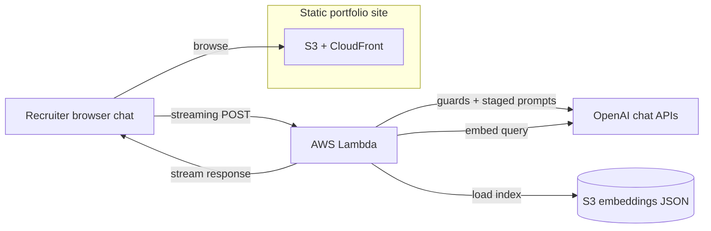

### Plan y alcance

Entregar un **portafolio static-first** (S3 + CloudFront) que aun así soporte un **asistente de reclutamiento con IA** serio: recuperar evidencia del texto público del portafolio, ejecutar prompts por etapas con guardrails y transmitir resultados en la UI—sin un servidor web clásico para el sitio público.

### Qué está en producción

- **Sitio**: export estático de Next.js, temas claro/oscuro MUI, i18n en cuatro idiomas, secciones parallax, búsqueda generada en build, Vitest + Playwright, CI con GitHub Actions.
- **Asistente**: chat en el navegador hacia una pequeña **AWS Lambda** detrás de una Function URL con **streaming de respuesta**; embeddings offline como JSON versionado en S3; RAG por coseno top-K, **input guard** determinístico e **intent gate** por LLM antes de la recuperación, rate limit en memoria por IP y CORS con lista permitida para producción.
- **Forma de la respuesta**: **tres** etapas de chat en streaming en un solo flujo—primero un **evaluador de evidencias** (cobertura de requisitos con imprescindible vs deseable, evidencia directa/adyacente/sin evidencia/contradictoria, avisos de similitud engañosa y **guía de puntuación** con techos para que la similitud vectorial no infle el encaje sola), luego un **analista** (solo síntesis, en el mismo bloque “thinking”, sin contradecir al evaluador) y por último la **evaluación para reclutadores** (la intensidad del encaje respeta el techo del evaluador). Los **marcadores ASCII de “thinking”** envuelven evaluador + analista para separar el razonamiento interno de la respuesta principal; al terminar el stream, **extracción estructurada de claims** y reencuentro vectorial añaden un bloque opcional de **Referencias** para citas fundamentadas.
- **Transparencia**: notas de arquitectura en el repo, página de términos para reclutadores, UI de revisión de evidencia y textos de racional para que los trade-offs sigan siendo auditables.

### Flujo de construcción (código generado por IA)

**El código fuente de la aplicación es 100% generado por agentes de codificación con IA** (Cursor como harness principal, Copilot en el circuito de revisión). Yo sigo siendo dueño de la intención de producto, modelado de amenazas, diseño de prompts, estrategia de pruebas, CI/CD y de lo que llega a producción—como revisar código entregado por un proveedor, salvo que el “proveedor” es el modelo y la IDE es la superficie de integración.

### Pilares técnicos

- Respuestas ancoradas en recuperación con referencias explícitas a posteriori; generación por etapas (**evaluador** con cobertura y techos, **analista** en síntesis, **pitch** para reclutadores) y citas contrastadas por similitud.
- Defensa en profundidad para texto no confiable de reclutadores (forma de entrada, clasificación de intención, system prompts estrictos, errores JSON fail-closed antes del streaming).
- Simplicidad operativa: bundle estático en S3/CloudFront; Lambda para inferencia; streaming mediante Vercel AI SDK (streamText y respuesta en formato data stream), con secretos y pasos de despliegue documentados.

### Arquitectura del asistente

La UI del portafolio sigue sirviéndose como assets estáticos desde S3 y CloudFront; el chat en streaming sigue el camino de Lambda del diagrama.

### Tech stack

Next.js, React, TypeScript, MUI, OpenAI, Vercel AI SDK, AWS S3, CloudFront, Lambda, Vitest, Playwright, GitHub Actions
