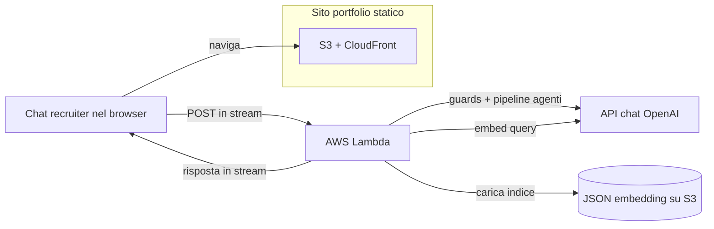
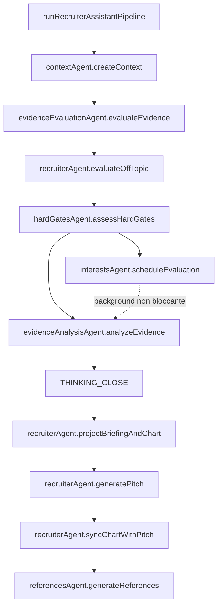

### Piano & perimetro

Consegnare un **portfolio static-first** (S3 + CloudFront) che supporti comunque un **assistente recruiting con IA** credibile: recuperare evidenze dal testo pubblico del portfolio, eseguire prompt a stadi con guardrail e streammare risultati nella UI—senza un web server classico per il sito pubblico.

### Cosa è in produzione

- **Sito**: export statico Next.js, temi chiaro/scuro MUI, i18n in quattro lingue, sezioni parallax, ricerca generata a build time, Vitest + Playwright, CI con GitHub Actions.
- **Assistente**: chat nel browser verso una piccola **AWS Lambda** dietro una Function URL con **response streaming**; embedding offline come JSON versionato su S3; RAG top-K con similarità coseno, **input guard** deterministico e **intent gate** LLM prima del retrieval, rate limit in-memory per IP e CORS con allowlist in produzione.
- **Layer agenti (Lambda)**:
  - Ogni stadio del pipeline è un **agente per tema** in `services/recruiter-assistant-api/src/recruiterAssistant/agents/`.
  - **Agenti:** contextAgent, evidenceEvaluationAgent, hardGatesAgent, interestsAgent, evidenceAnalysisAgent, recruiterAgent, referencesAgent; briefingAgent e chartAgent delegano da recruiterAgent.
  - **Comportamento:** `instructions.md` colocalizzato per agente, caricato nel bundle tramite `getAgentInstruction.ts`; TypeScript assembla prompt sensibili alla lingua e applica gli schema.
  - **Orchestrazione:** solo `runRecruiterAssistantPipeline.ts`—nessun testo di prompt incorporato.
- **Forma della risposta (stream)**:
  - **Thinking** (`THINKING_*`): valutatore evidenze (copertura requisiti, livelli di evidenza, avvisi su similarità fuorviante, guida al punteggio con tetti), poi analista (solo sintesi; non può contraddire il valutatore).
  - **Dopo la chiusura del thinking:** righe di briefing prep (`BRIEFING_PREP_*`), JSON del grafico profilo (`CHART_DATA_*`), pitch per recruiter (fit tecnico rispetta il tetto hard gate; clamp post-generazione). Riemissione opzionale del grafico allineata al pitch.
  - **Solo server:** valutazione hard gate; valutazione opzionale interessi privati (in background—non blocca ciò che l’utente vede).
  - **A stream completato:** estrazione strutturata delle claim e match vettoriale producono **References** opzionali.
- **Trasparenza**: note di architettura nel repo, pagina termini per i recruiter, UI di revisione evidenze e testi di razionale così i trade-off restano verificabili.

### Flusso di realizzazione (codice generato da IA)

**Il codice sorgente dell’applicazione è generato al 100% da agenti di coding con IA** (Cursor come harness principale, Copilot nel ciclo di revisione). Mantengo ownership di intento prodotto, threat modeling, progettazione dei prompt, strategia di test, CI/CD e di ciò che viene mergiato in produzione—come una revisione di codice “fornito”, solo che il fornitore è il modello e l’IDE è la superficie di integrazione.

### Pilastri tecnici

- Risposte ancorate al retrieval con riferimenti espliciti post-hoc; generazione a stadi (**valutatore** → **analista** → **pitch**) con tetti deterministici hard gate su fit e grafico.
- Manutenzione orientata agli agenti: comportamento in markdown; orchestrazione e contratti in TypeScript.
- Impostazioni security-minded per testo non attendibile (forma dell’input, classificazione intent, system prompt rigidi, errori JSON fail-closed prima dello streaming).
- Semplicità operativa: bundle statico su S3/CloudFront; Lambda per inferenza; streaming tramite Vercel AI SDK, con segreti e passi di deploy documentati.

### Deploy dell'assistente

La UI del portfolio resta servita come asset statici da S3 e CloudFront; il chat in streaming segue il percorso Lambda del diagramma.

### Orchestrazione pipeline (agenti)

`runRecruiterAssistantPipeline` invoca agenti per tema in ordine; non implementa la logica dei modelli.

### Tech stack

Next.js, React, TypeScript, MUI, OpenAI, Vercel AI SDK, AWS S3, CloudFront, Lambda, Vitest, Playwright, GitHub Actions
