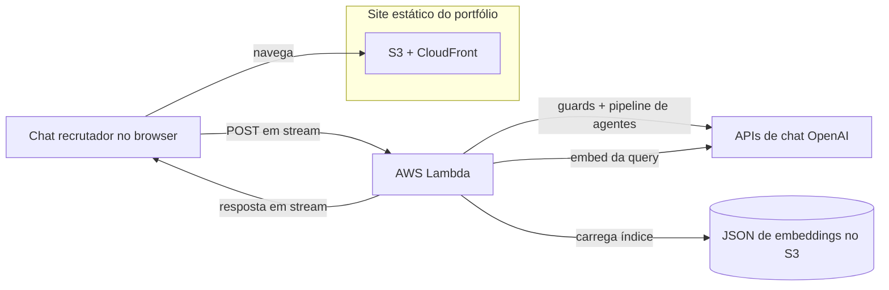
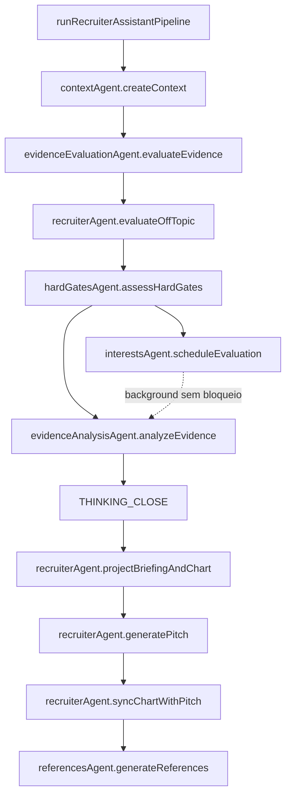

### Plano & escopo

Entregar um **portfólio static-first** (S3 + CloudFront) que ainda suporte um **assistente de recrutamento com IA** sério: recuperar evidências do texto público do portfólio, executar prompts em estágios com guardrails e transmitir resultados na UI—sem servidor web tradicional para o site público.

### O que foi para produção

- **Site**: export estático Next.js, temas claro/escuro MUI, i18n em quatro idiomas, seções parallax, busca gerada no build, Vitest + Playwright, CI com GitHub Actions.
- **Assistente**: chat no browser para uma pequena **AWS Lambda** atrás de Function URL com **streaming de resposta**; embeddings offline como JSON versionado no S3; RAG por cosseno top-K, **input guard** determinístico e **intent gate** por LLM antes da recuperação, rate limit em memória por IP e CORS com allowlist para produção.
- **Camada de agentes (Lambda)**:
  - Cada estágio do pipeline é um **agente por tema** em `services/recruiter-assistant-api/src/recruiterAssistant/agents/`.
  - **Agentes:** contextAgent, evidenceEvaluationAgent, hardGatesAgent, interestsAgent, evidenceAnalysisAgent, recruiterAgent, referencesAgent; briefingAgent e chartAgent delegam a partir de recruiterAgent.
  - **Comportamento:** `instructions.md` colocalizado por agente, carregado no bundle via `getAgentInstruction.ts`; TypeScript monta prompts sensíveis ao locale e aplica schemas.
  - **Orquestração:** apenas `runRecruiterAssistantPipeline.ts`—sem texto de prompt embutido.
- **Formato da resposta (stream)**:
  - **Thinking** (`THINKING_*`): avaliador de evidências (cobertura de requisitos, níveis de evidência, alertas de similaridade enganosa, orientação de pontuação com tetos), depois analista (apenas síntese; não pode contradizer o avaliador).
  - **Após fechar o thinking:** linhas de briefing prep (`BRIEFING_PREP_*`), JSON do gráfico de perfil (`CHART_DATA_*`), pitch para recrutador (aderência técnica respeita o teto de hard gates; clamp pós-geração). Reemissão opcional do gráfico alinhada ao pitch.
  - **Somente servidor:** avaliação de hard gates; avaliação opcional de interesses privados (em background—não bloqueia o que o usuário vê).
  - **Após o stream:** extração estruturada de claims e match vetorial geram **Referências** opcionais.
- **Transparência**: notas de arquitetura no repositório, página de termos para recrutadores, UI de revisão de evidências e textos de racional para que trade-offs fiquem auditáveis.

### Fluxo de construção (código gerado por IA)

**O código-fonte da aplicação é 100% gerado por agentes de codificação com IA** (Cursor como harness principal, Copilot no ciclo de revisão). Eu continuo dono de intenção de produto, modelagem de ameaças, desenho de prompts, estratégia de testes, CI/CD e do que entra em produção—no estilo de revisar código entregue por fornecedor, só que o “fornecedor” é o modelo e a IDE é a superfície de integração.

### Pilares técnicos

- Respostas ancoradas na recuperação com referências pós-hoc explícitas; geração em estágios (**avaliador** → **analista** → **pitch**) com tetos determinísticos de hard gates no fit e no gráfico.
- Manutenção orientada a agentes: comportamento em markdown; orquestração e contratos em TypeScript.
- Padrões conscientes de segurança para texto não confiável de recrutadores (formatação, classificação de intenção, system prompts rígidos, erros JSON fail-closed antes do streaming).
- Simplicidade operacional: bundle estático no S3/CloudFront; Lambda para inferência; streaming via Vercel AI SDK, com segredos e passos de deploy documentados.

### Implantação do assistente

A UI do portfólio continua sendo entregue como assets estáticos no S3 e na CloudFront; o tráfego do chat em stream segue o caminho da Lambda no diagrama.

### Orquestração do pipeline (agentes)

`runRecruiterAssistantPipeline` chama agentes por tema em ordem; não implementa a lógica dos modelos.

### Tech stack

Next.js, React, TypeScript, MUI, OpenAI, Vercel AI SDK, AWS S3, CloudFront, Lambda, Vitest, Playwright, GitHub Actions
