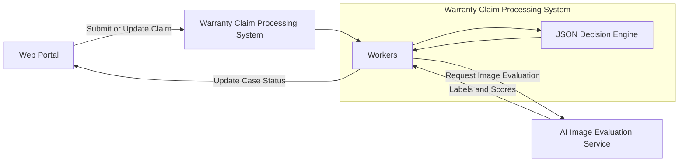
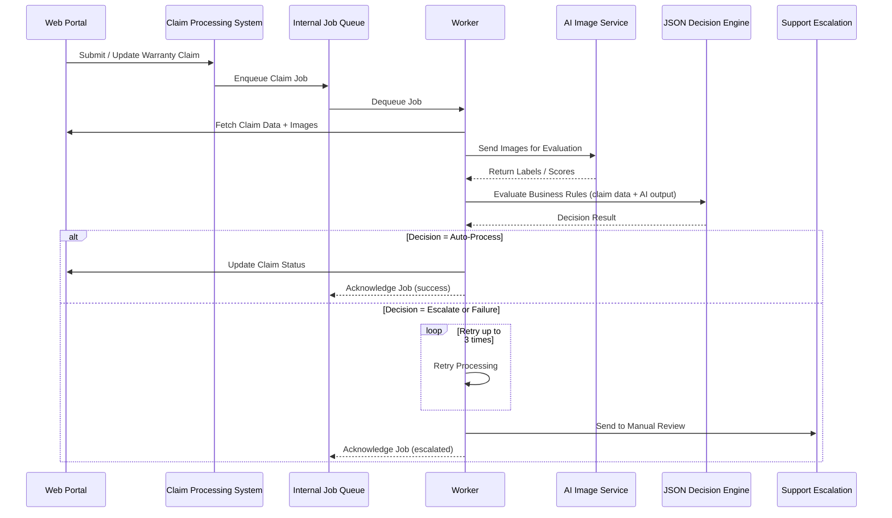

### Executive Summary

Designed and implemented an AI-driven warranty claim automation system for a consumer brand, transforming a manual, support-heavy workflow into a scalable, rule-based decision pipeline.

Delivered a resilient, cost-efficient architecture capable of processing image-based evaluations and applying dynamic business rules under strict reliability constraints.

### Impact & Results

- Reduced manual warranty claim processing overhead.
- Increased automation coverage while maintaining support escalation safeguards.
- Established a scalable, low-cost automation framework adaptable to evolving business rules.

### Architecture Diagram=

## Sequence Diagram

### Workflow Orchestration & Reliability

- Implemented asynchronous processing using BullMQ + Redis to ensure high availability and fault tolerance.
- Introduced bounded retry logic (3 attempts) with automatic escalation to support teams for unforeseen paths.
- Integrated automated case status updates with CRM systems to maintain operational visibility.
- Implemented alerting and monitoring to ensure continuous system reliability.

### Decision & Processing Architecture

- Built a JSON-based decision engine enabling dynamic rule ingestion and evaluation based on AI image classification results.
- Ensured deterministic behavior and extensibility through clean architectural boundaries.

### Platform & Engineering Practices

- Deployed on AWS using Kubernetes with infrastructure managed via Terraform and ArgoCD.
- Applied Clean Architecture principles for separation of concerns and long-term maintainability.
- Integrated GraphQL (Apollo Federation) services within a TypeScript-based ecosystem.
- Leveraged AI model integrations (including Google AI services) for image evaluation.
- Maintained high testability and documentation standards, using structured planning workflows and automated documentation updates.

---

_Confidential Client Engagement (Contract)_

_Details such as specific timelines, metrics, and internal identifiers have been generalized in accordance with confidentiality agreements._

---

### Tech Stack

TypeScript, Node.js, GraphQL, Apollo Federation, BullMQ, Redis, AWS, Kubernetes, Terraform, ArgoCD, AI Model Integrations, Google AI, Clean Architecture
