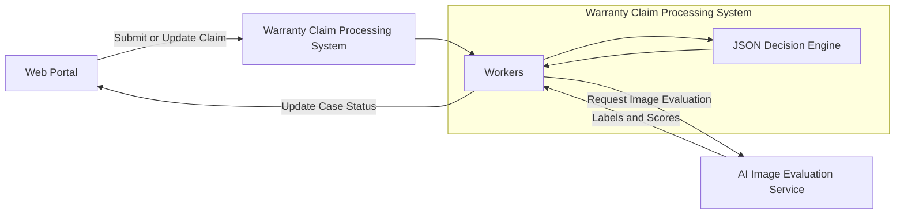
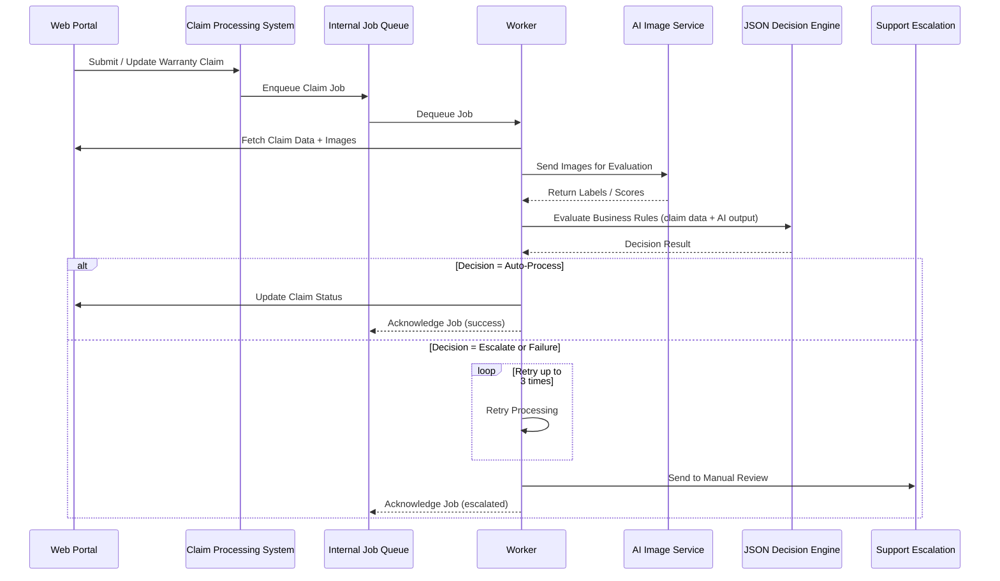

### Resumen Ejecutivo

Diseñé e implementé un sistema de automatización de garantías impulsado por IA para una marca de consumo, transformando un flujo manual y muy dependiente de soporte en un pipeline de decisión escalable y basado en reglas.

Entregué una arquitectura resiliente y eficiente en costes, capaz de procesar evaluaciones basadas en imágenes y aplicar reglas de negocio dinámicas bajo restricciones estrictas de fiabilidad.

### Impacto y Resultados

- Reducción de la carga manual en el procesamiento de reclamaciones de garantía.
- Mayor cobertura de automatización manteniendo salvaguardas de escalado a soporte.
- Establecimiento de un framework de automatización escalable y de bajo coste adaptable a reglas de negocio en evolución.

### Diagrama de Arquitectura

## Diagrama de Secuencia

### Orquestración del Flujo y Fiabilidad

- Implementé procesamiento asíncrono con BullMQ + Redis para alta disponibilidad y tolerancia a fallos.
- Introduje lógica de reintento acotada (3 intentos) con escalado automático a equipos de soporte en casos imprevistos.
- Integré actualizaciones automáticas del estado de casos con sistemas CRM para mantener visibilidad operativa.
- Implementé alertas y monitorización para garantizar la fiabilidad continua del sistema.

### Arquitectura de Decisión y Procesamiento

- Construí un motor de decisión basado en JSON que permite la ingestión y evaluación dinámica de reglas según los resultados de clasificación de imágenes por IA.
- Aseguré comportamiento determinista y extensibilidad mediante fronteras arquitectónicas claras.

### Plataforma y Prácticas de Ingeniería

- Despliegue en AWS con Kubernetes e infraestructura gestionada mediante Terraform y ArgoCD.
- Aplicación de los principios de Clean Architecture para separación de responsabilidades y mantenibilidad a largo plazo.
- Integración de servicios GraphQL (Apollo Federation) en un ecosistema basado en TypeScript.
- Uso de integraciones de modelos de IA (incluidos servicios Google AI) para evaluación de imágenes.
- Mantenimiento de altos estándares de testabilidad y documentación, con flujos de planificación estructurados y actualizaciones automatizadas de documentación.

---

_Compromiso Confidencial con Cliente (Contrato)_

_Los detalles como plazos, métricas e identificadores internos han sido generalizados de acuerdo con acuerdos de confidencialidad._

---

### Tech Stack

TypeScript, Node.js, GraphQL, Apollo Federation, BullMQ, Redis, AWS, Kubernetes, Terraform, ArgoCD, AI Model Integrations, Google AI, Clean Architecture
