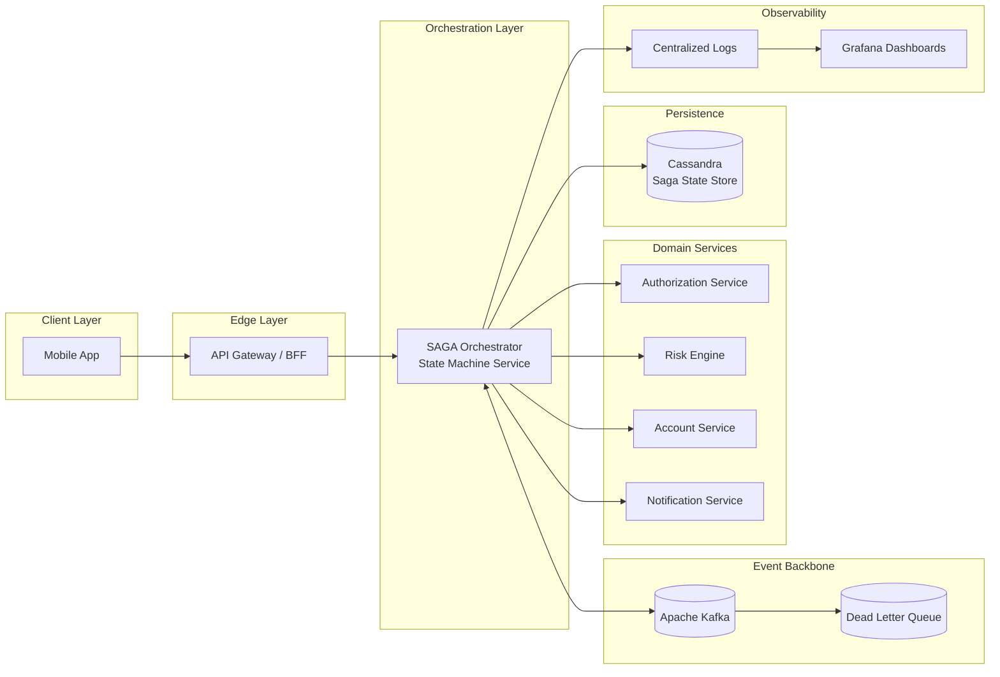
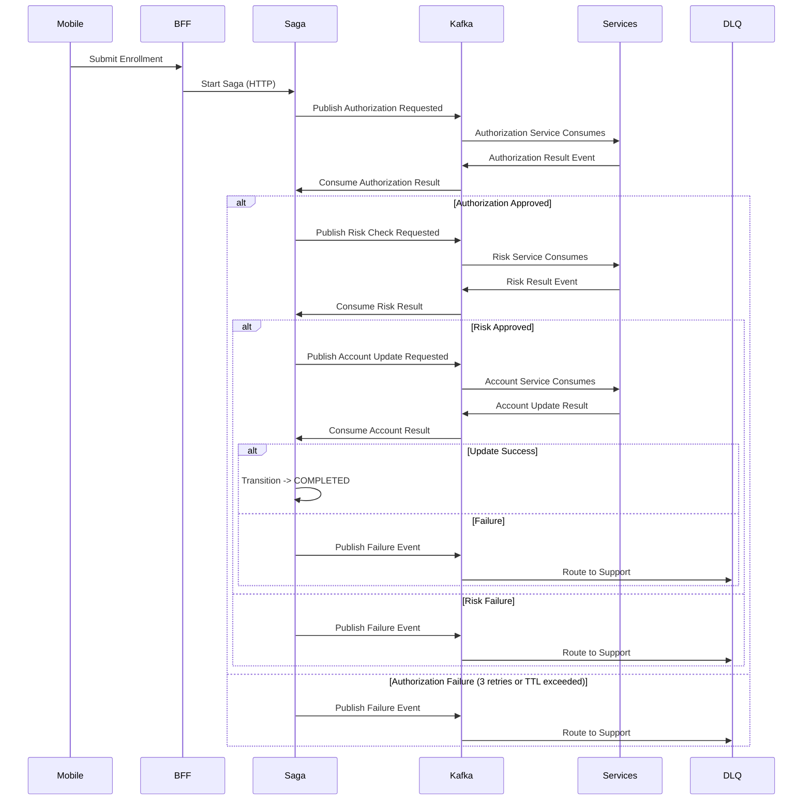

### Resumen Ejecutivo

Diseñé e implementé un servicio de orquestación distribuido basado en SAGA que permite a los clientes adherir al descubierto ("Cheque Especial") directamente por canales móviles.

La solución coordina múltiples dominios de backend (autorización, riesgo, servicios de cuenta, notificación) garantizando consistencia eventual, tolerancia a fallos y alta concurrencia en un entorno bancario regulado.

### Impacto en el Negocio

- Habilitó onboarding del producto descubierto por canal móvil
- Redujo dependencia operativa de sucursal/inscripción manual
- Aumentó adopción de productos digitales
- Reforzó trazabilidad y visibilidad operacional
- Contención de fallos mediante estrategia de retry estructurado + DLQ

### Visión de la Arquitectura

El servicio de orquestación actúa como motor de flujo centralizado, coordinando servicios de dominio de forma asíncrona por flujos de eventos y persistiendo el estado de la saga para recuperación y escalabilidad horizontal.

Infraestructura de soporte:

- Backbone de eventos: Apache Kafka
- Dead Letter Queue (DLQ) para inscripciones fallidas
- Persistencia de estado: Cassandra (snapshots de la saga)
- Observabilidad: logging centralizado y dashboards Grafana
- Streaming analítico: Apache Spark
- Informes y BI: Amazon Redshift

#### Características de la Arquitectura

- Orquestación SAGA orientada a máquina de estados
- Comunicación event-driven entre servicios
- Snapshots persistentes de la saga para recuperación tras fallo
- Instancias worker stateless para escalabilidad horizontal
- Tratamiento idempotente de eventos
- Estrategia de retry acotada con aislamiento de fallos
- Observabilidad operacional completa (logs + métricas)

### Modelo de la Máquina de Estados

Cada solicitud de inscripción se modela como una máquina de estados determinista con transiciones solo hacia adelante.

#### Estados Principales

- STARTED
- AUTHORIZED
- RISK_APPROVED
- ACCOUNT_UPDATED
- NOTIFIED
- COMPLETED
- FAILED

Las transiciones están guiadas por snapshot y son monótonas: una vez la saga avanza a un estado más reciente, eventos antiguos o duplicados no pueden sobrescribirlo.

### Diagrama de Secuencia – Inscripción en Descubierto Event-Driven (Kafka)

### Flujo de Inscripción y Tratamiento de Fallos

1. Cliente envía inscripción en descubierto por móvil.
2. API dispara nueva instancia de la saga (estado = STARTED).
3. Estado de la saga persistido en Cassandra.

4. Paso de autorización
   - Invocar servicio de autorización
   - En éxito → transición a AUTHORIZED
   - En fallo → retry (hasta 3 intentos)

5. Evaluación de riesgo
   - Invocar motor de riesgo
   - En aprobación → transición a RISK_APPROVED
   - En fallo → retry (intentos acotados)

6. Actualización de cuenta
   - Actualizar límite de descubierto
   - En éxito → transición a ACCOUNT_UPDATED
   - En fallo → retry (intentos acotados)

7. Notificación
   - Enviar mensaje de confirmación
   - Transición a COMPLETED

### Estrategia de Retry y Dead Letter

- Cada paso admite hasta 3 intentos de retry
- Un TTL global de aproximadamente 5 minutos acota la ejecución de la saga
- Si se agotan los retries o se excede el TTL:
  - La inscripción se deriva a la Dead Letter Queue (DLQ)
  - El caso se envía a un equipo de soporte dedicado para procesamiento manual

Este diseño evita retries indefinidos, protege la estabilidad del sistema y asegura que las solicitudes del cliente no se pierdan en silencio.

### Modelo de Idempotencia y Concurrencia

- Sin bloqueo distribuido en Cassandra
- Workers del orquestador stateless y escalables horizontalmente
- Procesamiento duplicado no corrompe el estado

Si un sistema downstream ya ha procesado una solicitud:

- El sistema downstream rechaza la operación duplicada
- La máquina de estados ignora eventos obsoletos
- La comparación por snapshot asegura solo transiciones de avance

La progresión del estado es monótona.  
Eventos más antiguos no pueden sobrescribir un estado de saga más avanzado.

Esto garantiza seguridad sin introducir cuellos de botella de coordinación.

### Observabilidad y Transparencia Operacional

- Logs estructurados para cada transición de la saga
- Agregación centralizada de logs
- Trazas operacionales consultables en Grafana
- Monitorización de la DLQ para flujos de intervención manual
- Métricas en tiempo real para sistemas de analytics e informes

Los equipos operativos pueden rastrear cualquier inscripción de extremo a extremo en segundos.

### Diseño de Escalabilidad y Resiliencia

- Workers orquestadores stateless
- Coordinación distribuida basada en Kafka
- Persistencia del estado de la saga en Cassandra
- Capacidad segura de replay y reanudación
- Modelo de retry acotado que evita fallos en cascada
- Diseñado para alta concurrencia en picos de uso móvil

---

_Asociado con Itaú Unibanco_

_Detalles como plazos, métricas e identificadores internos han sido generalizados de acuerdo con acuerdos de confidencialidad._

---

### Tech Stack

Java, Spring Boot, Spring State Machine, Apache Kafka, Cassandra, Apache Spark, Amazon Redshift, Docker, JUnit, Grafana
