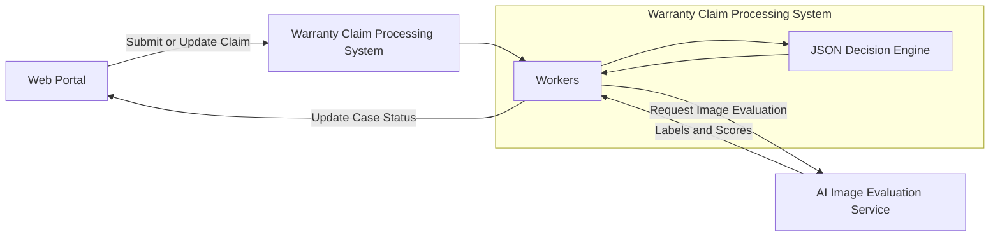
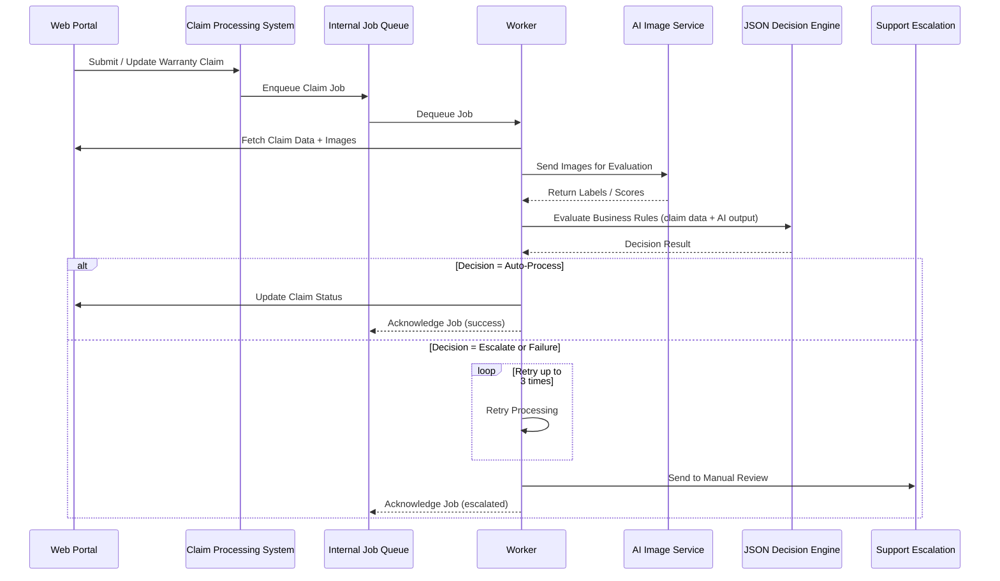

### Sintesi Esecutiva

Ho progettato e implementato un sistema di automazione delle richieste di garanzia guidato dall'IA per un brand consumer, trasformando un flusso manuale e ad alto carico di supporto in una pipeline decisionale scalabile e basata su regole.

Ho fornito un'architettura resiliente ed efficiente in termini di costi, in grado di elaborare valutazioni basate su immagini e applicare regole di business dinamiche sotto rigorosi vincoli di affidabilità.

### Impatto e Risultati

- Riduzione del carico manuale nella gestione delle richieste di garanzia.
- Maggiore copertura dell'automazione mantenendo le salvaguardie di escalation al supporto.
- Istituzione di un framework di automazione scalabile e a basso costo adattabile alle regole di business in evoluzione.

### Diagramma di Architettura

## Diagramma di Sequenza

### Orchestrazione del Flusso e Affidabilità

- Ho implementato l'elaborazione asincrona con BullMQ + Redis per alta disponibilità e tolleranza ai guasti.
- Ho introdotto logica di retry limitata (3 tentativi) con escalation automatica ai team di supporto per percorsi imprevisti.
- Ho integrato aggiornamenti automatici dello stato dei casi con i sistemi CRM per mantenere la visibilità operativa.
- Ho implementato alerting e monitoraggio per garantire l'affidabilità continua del sistema.

### Architettura Decisionale e di Elaborazione

- Ho costruito un motore decisionale basato su JSON che consente l'ingestione e la valutazione dinamica delle regole in base ai risultati della classificazione delle immagini tramite IA.
- Ho garantito comportamento deterministico ed estensibilità attraverso confini architetturali chiari.

### Piattaforma e Pratiche di Ingegneria

- Deployment su AWS con Kubernetes e infrastruttura gestita tramite Terraform e ArgoCD.
- Applicazione dei principi di Clean Architecture per separazione delle responsabilità e manutenibilità a lungo termine.
- Integrazione di servizi GraphQL (Apollo Federation) in un ecosistema basato su TypeScript.
- Utilizzo di integrazioni di modelli IA (inclusi i servizi Google AI) per la valutazione delle immagini.
- Mantenimento di elevati standard di testabilità e documentazione, con flussi di pianificazione strutturati e aggiornamenti automatizzati della documentazione.

---

_Engagement Confidenziale con Cliente (Contratto)_

_I dettagli quali tempistiche, metriche e identificatori interni sono stati generalizzati in conformità con gli accordi di riservatezza._

---

### Tech Stack

TypeScript, Node.js, GraphQL, Apollo Federation, BullMQ, Redis, AWS, Kubernetes, Terraform, ArgoCD, AI Model Integrations, Google AI, Clean Architecture
