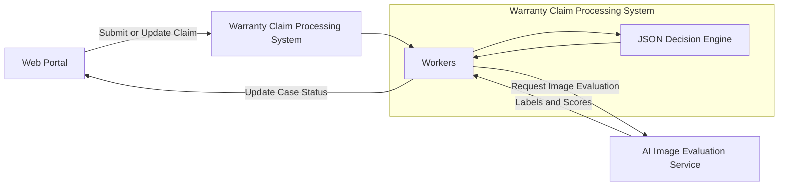
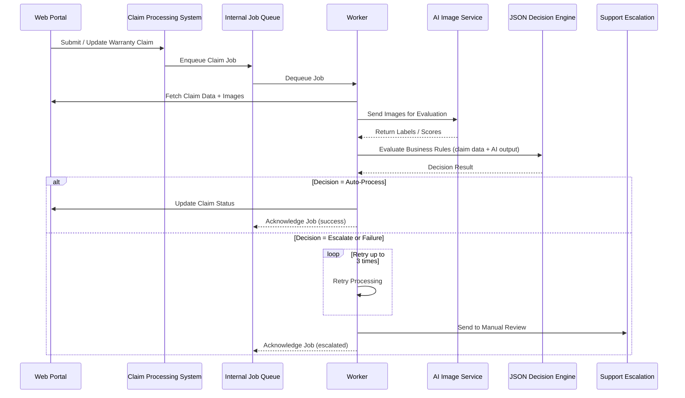

### Resumo Executivo

Projetei e entreguei uma plataforma de automação de garantias orientada a IA para um fluxo de e-commerce voltado ao consumidor, substituindo um processo manual e pesado em suporte por um pipeline de decisão escalável que coordena avaliação de imagens por IA, regras de negócio determinísticas, atualizações de CRM, automação de chatbot e caminhos de escalonamento humano.

O sistema foi construído em torno de um motor de decisão baseado em JSON e workers assíncronos, para que regras de negócio pudessem evoluir sem exigir mudanças arriscadas em produção no fluxo central de orquestração. Em vez de tratar a saída da IA como decisão final, a plataforma usa análise de imagens por IA como uma entrada em uma camada de regras controlada, mantendo decisões explicáveis, auditáveis e seguras para escalar quando a confiança ou a cobertura de regras é insuficiente.

### Impacto e Resultados

- Reduzi a sobrecarga manual no processamento de garantias ao automatizar caminhos de decisão repetíveis, preservando escalonamento para suporte em casos incertos, com falha ou excepcionais.
- Aumentei a cobertura de automação com regras de negócio dinâmicas, permitindo novos cenários de reclamação e políticas operacionais sem interromper a plataforma inteira.
- Melhorei a confiabilidade operacional com processamento assíncrono, retentativas limitadas, recuperação baseada em filas e estados explícitos de falha para fluxos longos de garantia.
- Conectei engenharia, negócio, suporte, infraestrutura, segurança e produto por meio de rastreabilidade em tickets, especificações compartilhadas, logs de decisão e checkpoints de integração.
- Estabeleci um framework reutilizável de automação para fluxos de suporte assistidos por IA, em que regras determinísticas, atualizações em sistemas externos e revisão humana precisam coexistir com segurança.

### Diagrama de Arquitetura

## Diagrama de Sequência

### Orquestração de Fluxo e Confiabilidade

- Arquitetei processamento assíncrono com BullMQ e workers Redis para desacoplar a avaliação longa de reclamações das interações voltadas ao usuário e a sistemas externos.
- Modelei o ciclo de vida da reclamação como um fluxo em máquina de estados multifásico, coordenando avaliação por IA, execução de regras, atualizações de CRM, handoffs de chatbot, retentativas e estados de escalonamento.
- Introduzi lógica de retentativa limitada com escalonamento automático para equipes de suporte quando sistemas externos falhavam, a avaliação por IA era inconclusiva ou o motor de decisão atingia um caminho desconhecido.
- Projetei recuperação baseada em filas e salvaguardas de processamento idempotente para que jobs duplicados, atrasados ou parcialmente falhos pudessem ser tratados sem corromper o estado da reclamação.
- Integrei alertas, monitoramento e visibilidade operacional sobre saúde das filas, falhas de workers, esgotamento de retentativas e erros de integrações externas.

### Arquitetura de Decisão e Processamento

- Construí um motor de decisão baseado em JSON que avalia saídas estruturadas de classificação de imagens por IA contra regras de negócio configuráveis.
- Mantive a saída do modelo de IA atrás de limites determinísticos de regras, para que decisões de garantia permanecessem explicáveis, testáveis e revisáveis por negócio e suporte.
- Projetei o motor de regras para suportar cenários de negócio em evolução sem forçar mudanças de alto risco em orquestração, filas ou código de integração.
- Integrei atualizações de status de casos no Salesforce para que equipes de suporte acompanhassem progresso, resultados automatizados e motivos de escalonamento nos fluxos operacionais existentes.
- Conectei automação de chatbot ao fluxo de garantia para que clientes recebessem próximos passos guiados enquanto a plataforma continuava processando de forma assíncrona em segundo plano.

### Plataforma e Práticas de Engenharia

- Apliquei limites de Clean Architecture para separar orquestração, avaliação de regras, adaptadores externos, workers de fila, serviços GraphQL e preocupações de infraestrutura.
- Integrei serviços GraphQL com Apollo Federation em um ecossistema TypeScript e Node.js.
- Implantei na AWS com Kubernetes, com infraestrutura e entrega gerenciadas por Terraform e ArgoCD.
- Defini e mantive cobertura E2E para jornadas críticas de garantia, incluindo caminhos de automação bem-sucedidos, cenários de retentativa, fluxos de escalonamento e falhas de integrações externas.
- Usei fluxos de planejamento estruturados, documentação assistida por IA revisada por humanos e logs de decisão para manter escolhas de implementação visíveis para engenharia e stakeholders não técnicos.

---

_Engajamento com Cliente Confidencial (Contrato)_

_Detalhes como cronogramas específicos, métricas, identificadores de marca, nomes de fornecedores e nomes internos de sistemas foram generalizados em conformidade com acordos de confidencialidade._

---

### Stack Tecnológica

TypeScript, Node.js, GraphQL, Apollo Federation, BullMQ, Redis, AWS, Kubernetes, Terraform, ArgoCD, Integração Salesforce, Automação de Chatbot, Integrações de Modelos de IA, Avaliação de Imagens, Clean Architecture, Testes E2E
