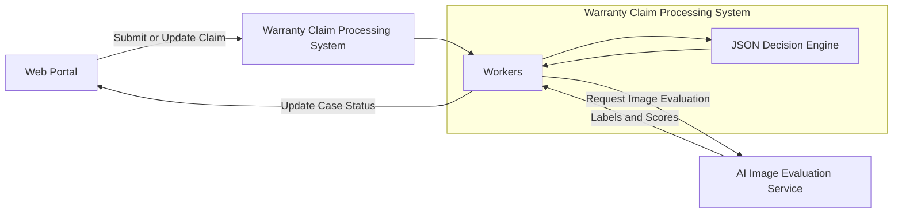
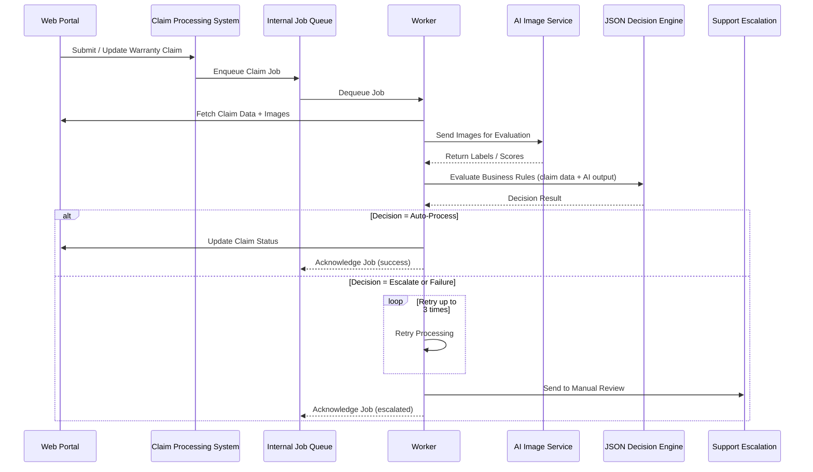

### Resumo Executivo

Projetei e implementei um sistema de automação de garantias orientado a IA para uma marca de consumo, transformando um fluxo manual e pesado em suporte em um pipeline de decisão escalável e baseado em regras.

Entreguei uma arquitetura resiliente e eficiente em custo, capaz de processar avaliações baseadas em imagens e aplicar regras de negócio dinâmicas sob restrições rígidas de confiabilidade.

### Impacto e Resultados

- Redução da sobrecarga manual no processamento de garantias.
- Aumento da cobertura de automação mantendo salvaguardas de escalonamento para suporte.
- Estabelecimento de um framework de automação escalável e de baixo custo adaptável a regras de negócio em evolução.

### Diagrama de Arquitetura

## Diagrama de Sequência

### Orquestração de Fluxo e Confiabilidade

- Implementei processamento assíncrono com BullMQ + Redis para alta disponibilidade e tolerância a falhas.
- Introduzi lógica de retry limitada (3 tentativas) com escalonamento automático para equipes de suporte em cenários imprevistos.
- Integrei atualizações automáticas de status de caso com sistemas de CRM para manter visibilidade operacional.
- Implementei alertas e monitoramento para garantir confiabilidade contínua do sistema.

### Arquitetura de Decisão e Processamento

- Construí um motor de decisão baseado em JSON que permite ingestão e avaliação dinâmica de regras com base nos resultados da classificação de imagens por IA.
- Garanti comportamento determinístico e extensibilidade por meio de fronteiras arquiteturais claras.

### Plataforma e Práticas de Engenharia

- Implantação na AWS com Kubernetes e infraestrutura gerenciada via Terraform e ArgoCD.
- Aplicação dos princípios de Clean Architecture para separação de responsabilidades e manutenibilidade de longo prazo.
- Integração de serviços GraphQL (Apollo Federation) em um ecossistema baseado em TypeScript.
- Uso de integrações de modelos de IA (incluindo serviços Google AI) para avaliação de imagens.
- Manutenção de alto nível de testabilidade e documentação, com fluxos de planejamento estruturados e atualizações automatizadas de documentação.

---

_Engajamento Confidencial com Cliente (Contrato)_

_Detalhes como prazos, métricas e identificadores internos foram generalizados em conformidade com acordos de confidencialidade._

---

### Tech Stack

TypeScript, Node.js, GraphQL, Apollo Federation, BullMQ, Redis, AWS, Kubernetes, Terraform, ArgoCD, AI Model Integrations, Google AI, Clean Architecture
