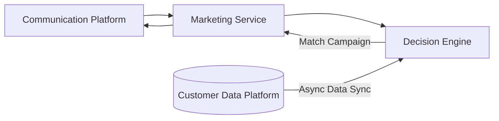
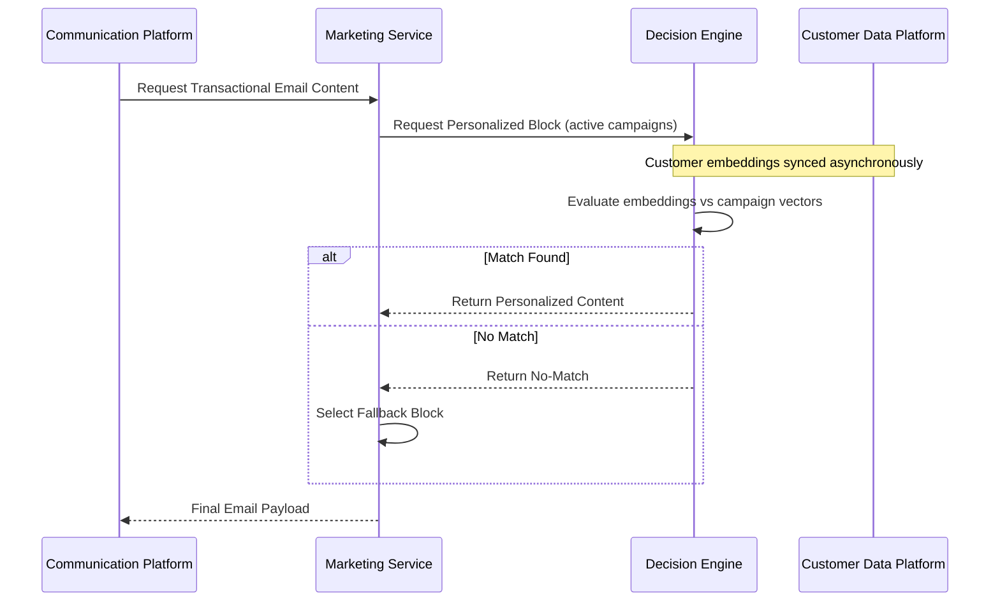

## Real-Time AI Personalization Engine for Transactional Email Flows

### Executive Summary

Designed and led the implementation of a low-latency, vector-based decision engine for AI-driven personalization inside revenue-critical transactional email flows, including purchase-confirmation experiences where content retrieval must never disrupt the core transactional message.

The platform transformed customer interaction signals into embeddings, compared them against live campaign and peer-profile vectors, and returned personalized content blocks synchronously inside a strict response window of ~200ms at ~100 RPS. Instead of treating personalization as a static rules table, the system used similarity matching and “Power User” profile embeddings to select campaigns that better aligned with each customer’s behavior.

The service was built as a containerized Node.js/TypeScript microservice exposed through REST APIs and integrated into Klarna’s transactional email pipeline, with safe fallback behavior, Datadog observability, SLO monitoring, and on-call ownership to protect high-volume customer communication.

### Impact & Results

- Increased engagement with personalized content blocks in transactional emails, improving campaign click-through and downstream conversion opportunities.
- Improved CTR from ~1.4% to ~1.8%; at 1M monthly purchases, that represents roughly 4,000 additional monthly clicks, or ~3,000 incremental clicks after accounting for the previous baseline depending on attribution assumptions.
- Established a scalable, low-latency foundation for AI-powered personalization that could be extended beyond purchase-confirmation flows into additional transactional and lifecycle channels.
- Enabled more adaptive campaign selection by matching customer behavior embeddings against live campaign vectors instead of relying only on static segmentation rules.
- Protected transactional email reliability with deterministic fallback paths so failed, slow, or unavailable personalization never blocked the core purchase-confirmation message.

### Sequence Diagram - Personalization Flow with Fallback

### Decision Engine Architecture

- Designed and implemented a vector-based decision engine that performed real-time embedding similarity matching between customer interaction profiles, active campaign vectors, and peer-based recommendation signals.
- Built “Power User” profile logic by representing high-performing customer behavior as embeddings and matching similar customers to campaigns with stronger expected engagement.
- Kept the personalization decision path bounded by latency constraints, ensuring recommendation logic could run synchronously inside purchase-confirmation email generation without degrading the customer communication pipeline.
- Designed campaign matching as a service-level decision layer rather than embedding business logic directly into email templates, making the system easier to test, evolve, observe, and reuse.
- Supported live campaign feeds and eligibility constraints so the engine could return only valid, currently active content blocks for each request.

### Service Integration

- Deployed the engine as a containerized Node.js/TypeScript microservice integrated with the transactional email platform.
- Exposed REST endpoints for synchronous content retrieval during purchase-confirmation flows, returning personalized blocks when confidence, eligibility, and latency constraints were satisfied.
- Integrated customer interaction data, campaign metadata, and peer-profile embeddings into a single runtime decision flow.
- Implemented safe fallback mechanisms so missing data, unavailable campaign feeds, slow vector matching, or service errors returned default content rather than disrupting transactional email delivery.
- Collaborated with data platform, incentives, content, marketing, analytics, and platform engineering teams to align campaign requirements, data availability, experimentation goals, and operational constraints.

### Observability, Performance & Reliability

- Instrumented end-to-end tracing, latency histograms, error-rate metrics, and custom business metrics in Datadog to monitor recommendation quality and system health.
- Defined and monitored SLOs/SLAs for response time, availability, and failure behavior in a revenue-critical email generation path.
- Participated in 24/7 on-call rotation, owning operational readiness for incidents affecting personalization, campaign retrieval, or transactional email integration.
- Used fallback telemetry to distinguish healthy default-content behavior from personalization failures that required engineering action.
- Added automated tests around decision behavior, REST contracts, fallback scenarios, and integration boundaries to reduce regression risk in campaign delivery.

### Product & Business Context

- The engine operated inside transactional email flows, where personalization had to improve engagement without creating risk for mandatory customer communication.
- The design balanced experimentation, campaign performance, user relevance, and reliability by separating recommendation decisions from the core email delivery path.
- The architecture created a reusable pattern for future AI-assisted personalization use cases: collect behavioral signals, represent them as embeddings, match them against eligible content, return the best candidate under a strict latency budget, and fall back safely when confidence or availability is insufficient.

---

_Associated with Klarna_

_Details such as specific timelines, metrics, and internal identifiers have been generalized in accordance with confidentiality agreements._

---

### Tech Stack

TypeScript, Node.js, REST APIs, AWS, Containerized Microservices, Datadog, Jest, Vector Search, Embeddings, Similarity Matching, Recommendation Systems, Transactional Email, DDD
