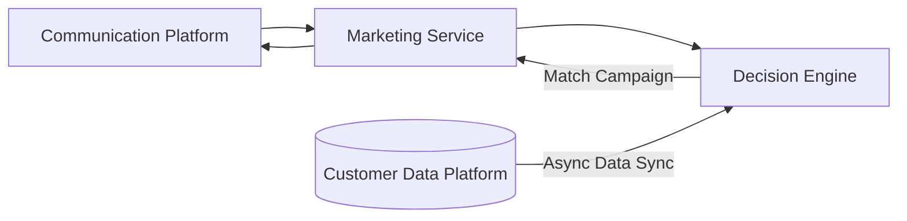
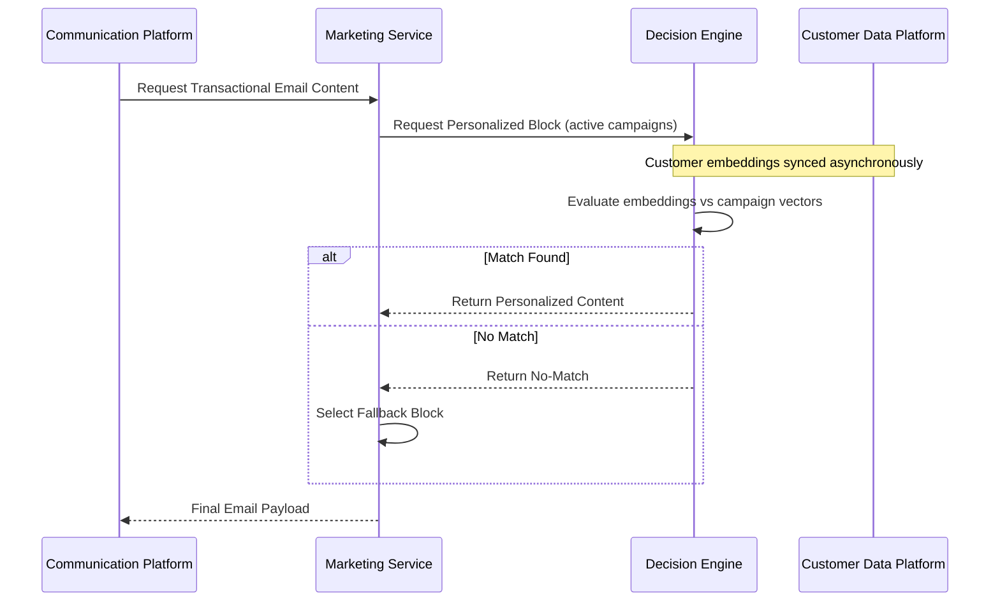

## Motor de Personalización con IA en Tiempo Real para Flujos de Email Transaccional

### Resumen Ejecutivo

Diseñé y lideré la implementación de un motor de decisión de baja latencia basado en vectores que impulsa la personalización con IA en flujos de email transaccionales críticos para ingresos (p. ej. confirmaciones de compra).

Construí un sistema que transforma datos de interacción del cliente en embeddings y los compara con campañas activas en tiempo real, permitiendo la selección de contenido contextual dentro de restricciones estrictas de latencia (~200ms a ~100 RPS).

### Impacto y Resultados

- Mayor engagement con bloques de contenido personalizado, mejorando clics y conversión en emails transaccionales.
- Establecimiento de una base escalable y de baja latencia para personalización con IA en canales adicionales.
- CTR de 1,4% a 1,8% — Para 1 millón de compras mensuales representa ~3k visitas adicionales al mes a campañas y anuncios de la empresa.

### Diagrama de Secuencia – Flujo de Personalización con Fallback

### Arquitectura del Motor de Decisión

- Diseñé e implementé un motor de decisión basado en vectores que realiza correspondencia de similitud de embeddings en tiempo real con vectores de campañas activas.
- Construí lógica de perfilado entre pares usando embeddings de "Power User" para orientar decisiones de recomendación bajo restricciones deterministas de latencia.

### Integración de Servicios

- Desplegado como microservicio Node.js/TypeScript containerizado dentro del pipeline de email transaccional.
- Endpoints REST expuestos para recuperación síncrona de contenido durante flujos de confirmación de compra.
- Mecanismos de fallback seguros implementados para garantizar cero disrupción en la mensajería transaccional principal.

### Observabilidad, Rendimiento y Fiabilidad

- Trazado de extremo a extremo y métricas personalizadas de latencia/error instrumentadas en Datadog.
- SLOs/SLAs definidos y monitorizados para tiempo de respuesta y disponibilidad.
- Participación en guardia 24/7 para este sistema crítico de ingresos.

---

_Asociado con Klarna_

_Los detalles como plazos, métricas e identificadores internos han sido generalizados de acuerdo con acuerdos de confidencialidad._

---

### Tech Stack

TypeScript, Node.js, REST APIs, AWS, Datadog, Jest, Vector Search, Embeddings, DDD
