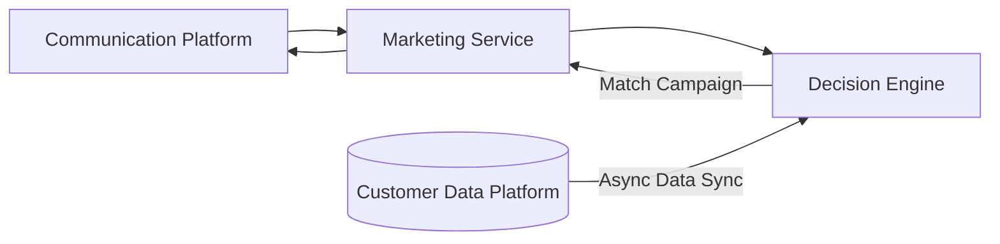
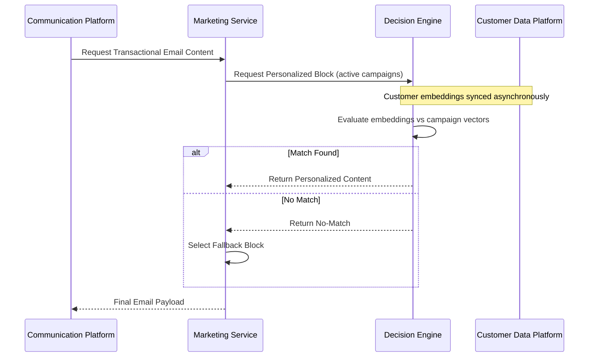

## Motor de Personalização com IA em Tempo Real para Fluxos de E-mail Transacional

### Resumo Executivo

Projetei e liderei a implementação de um motor de decisão de baixa latência baseado em vetores que alimenta a personalização orientada a IA em fluxos de e-mail transacionais críticos para receita (ex.: confirmações de compra).

Construí um sistema que transforma dados de interação do cliente em embeddings e os compara com campanhas ativas em tempo real, permitindo seleção de conteúdo contextual dentro de restrições rígidas de latência (~200ms a ~100 RPS).

### Impacto e Resultados

- Aumento do engajamento com blocos de conteúdo personalizados, melhorando cliques e conversão em e-mails transacionais.
- Estabelecimento de uma base escalável e de baixa latência para personalização com IA em canais adicionais.
- CTR de 1,4% para 1,8% — Para 1 milhão de compras mensais representa ~3 mil visitas adicionais por mês às campanhas e anúncios da empresa.

### Diagrama de Sequência – Fluxo de Personalização com Fallback

### Arquitetura do Motor de Decisão

- Projetei e implementei um motor de decisão baseado em vetores que realiza correspondência de similaridade de embeddings em tempo real com vetores de campanhas ativas.
- Construí lógica de perfilagem entre pares usando embeddings de "Power User" para orientar decisões de recomendação sob restrições determinísticas de latência.

### Integração de Serviços

- Implantado como microsserviço Node.js/TypeScript containerizado dentro do pipeline de e-mail transacional.
- Endpoints REST expostos para recuperação síncrona de conteúdo durante fluxos de confirmação de compra.
- Mecanismos de fallback seguros implementados para garantir zero disrupção na mensageria transacional principal.

### Observabilidade, Performance e Confiabilidade

- Rastreamento ponta a ponta e métricas customizadas de latência/erro instrumentados no Datadog.
- SLOs/SLAs definidos e monitorados para tempo de resposta e disponibilidade.
- Participação em plantão 24/7 para este sistema crítico de receita.

---

_Associado à Klarna_

_Detalhes como prazos, métricas e identificadores internos foram generalizados em conformidade com acordos de confidencialidade._

---

### Tech Stack

TypeScript, Node.js, REST APIs, AWS, Datadog, Jest, Vector Search, Embeddings, DDD
