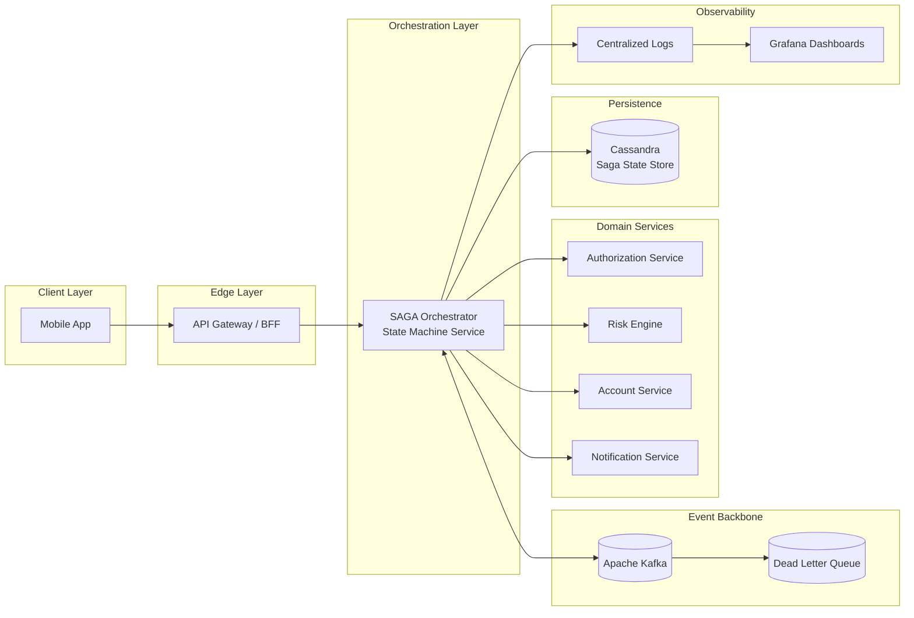
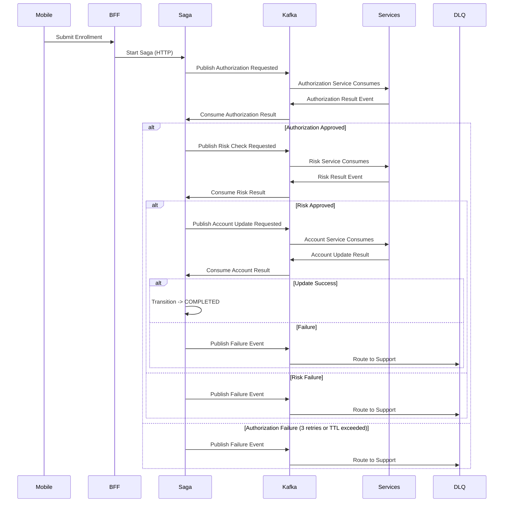

### Executive Summary

Designed and delivered a distributed SAGA-based orchestration service that enabled customers to subscribe to the overdraft product (“Cheque Especial”) directly through mobile channels, replacing a more branch/manual-dependent enrollment path with a digital, event-driven workflow.

The service coordinated multiple banking domains—including authorization, risk assessment, account updates, and customer notification—while preserving eventual consistency, operational recoverability, and auditability in a regulated financial environment. Each enrollment was modeled as a deterministic state-machine workflow, with state snapshots persisted in Cassandra and asynchronous domain coordination handled through Kafka.

The goal was not only to expose a new mobile enrollment feature, but to create a resilient orchestration layer capable of surviving partial failures, duplicate events, downstream retries, and manual support handoffs without silently losing customer requests.

### Business Impact

- Enabled a new mobile channel for overdraft enrollment, expanding access beyond branch/manual or support-assisted flows.
- Reduced operational dependency on manual enrollment and backoffice intervention for standard customer journeys.
- Improved digital product adoption by allowing eligible customers to complete overdraft signup directly from the mobile app.
- Strengthened auditability by persisting saga state snapshots and making each workflow transition traceable.
- Improved reliability by isolating failed or timed-out enrollments through bounded retries, TTL limits, DLQ routing, and support escalation.
- Created a reusable orchestration pattern for long-running banking workflows that require eventual consistency across multiple backend domains.

### Architecture Overview

The orchestration service operated as a centralized workflow engine responsible for coordinating domain services asynchronously. Mobile requests entered through the application/BFF path and triggered a new saga instance; the orchestrator then advanced the workflow by publishing and consuming Kafka events, persisting progress snapshots, and applying deterministic state transitions.

Supporting Infrastructure:

- Event Backbone: Apache Kafka
- Schema Governance: Avro + Confluent Schema Registry
- Dead Letter Queue (DLQ): failed or expired enrollment workflows
- State Persistence: Cassandra saga state and snapshots
- Observability: centralized logs, Grafana dashboards, operational queries
- Analytics Streaming: Apache Spark
- Reporting & BI: Amazon Redshift

#### Architectural Characteristics

- State-machine-driven SAGA orchestration for long-running financial workflows
- Event-driven communication between the orchestrator and downstream banking domains
- Persistent saga snapshots enabling recovery, replay, and manual investigation
- Stateless orchestrator workers for horizontal scalability
- Idempotent handling through downstream guarantees plus monotonic saga-state progression
- Bounded retry strategy with TTL-based failure isolation
- DLQ escalation path for support teams when automated processing could not safely complete
- Full operational observability through logs, metrics, dashboards, and queryable state history

### State Machine Model

Each enrollment request was modeled as a deterministic state machine with forward-only transitions. The orchestrator persisted snapshots after meaningful transitions so the workflow could resume safely after process restarts, duplicate events, or downstream delays.

#### Core States

- STARTED
- AUTHORIZED
- RISK_APPROVED
- ACCOUNT_UPDATED
- NOTIFIED
- COMPLETED
- FAILED

State transitions were monotonic: once a saga advanced to a newer state, stale or duplicated events could not move it backward or overwrite the more advanced snapshot.

### Sequence Diagram - Event-Driven Overdraft Enrollment (Kafka-Based)

### Enrollment Flow & Failure Handling

1. Customer submits an overdraft enrollment request through the mobile app.
2. Mobile calls the BFF/API layer, which creates or triggers a new saga instance.
3. The orchestrator persists the initial saga state in Cassandra.

4. Authorization Step
   - Request authorization through the authorization domain.
   - On success, transition to `AUTHORIZED` and persist a new snapshot.
   - On transient failure, retry within bounded limits.

5. Risk Assessment
   - Request eligibility/risk evaluation through the risk domain.
   - On approval, transition to `RISK_APPROVED`.
   - On failure or unavailable response, retry only while the workflow remains within its execution budget.

6. Account Update
   - Request overdraft account/limit update through the account domain.
   - On success, transition to `ACCOUNT_UPDATED`.
   - On duplicate or already-processed downstream state, treat the response according to the current saga snapshot and avoid corrupting the workflow.

7. Notification
   - Send confirmation or final customer communication.
   - Transition to `NOTIFIED`, then `COMPLETED` when the workflow reaches its terminal success state.

### Retry & Dead Letter Strategy

- Each critical step supported bounded retries, commonly up to 3 attempts.
- A global time-to-live (TTL) of approximately 5 minutes bounded the full saga execution.
- If retries were exhausted, the TTL was exceeded, or the workflow reached a state that could not be safely resolved automatically:
  - The enrollment was routed to a Dead Letter Queue (DLQ).
  - The final state and relevant snapshots remained available for investigation.
  - A dedicated support team could process or reconcile the case manually.

This design avoided indefinite retries and protected downstream systems from retry storms while ensuring customer requests were never silently lost.

### Idempotency & Concurrency Model

The orchestrator was designed to scale horizontally without relying on distributed locks in Cassandra. Safety came from a combination of downstream idempotency, state-machine rules, and snapshot comparison.

- Orchestrator workers were stateless and horizontally scalable.
- Duplicate messages or repeated step execution could occur under normal distributed-system conditions.
- Downstream systems were expected to reject or safely handle duplicate operations they had already processed.
- The orchestrator evaluated responses against the current saga snapshot before applying any transition.
- Stale events, delayed responses, or duplicate callbacks could not override a more advanced state.

If a downstream system had already processed a request, the duplicate response would not corrupt the saga. The orchestrator either ignored the stale event or interpreted it in the context of the latest persisted snapshot.

State progression was monotonic. Older events could not override a more advanced saga state, which provided safety without introducing coordination bottlenecks.

### Observability & Operational Transparency

- Structured logs for each saga transition, retry attempt, downstream request, failure state, and DLQ routing event.
- Centralized log aggregation and Grafana dashboards for operational investigation.
- Queryable saga snapshots in Cassandra to reconstruct enrollment history.
- DLQ monitoring for manual intervention workflows.
- Metrics for success rate, retry volume, step latency, timeout rate, and failure concentration by downstream domain.
- Analytics streaming into Apache Spark and Amazon Redshift to support reporting and business visibility.

Operational teams could trace an enrollment end to end using logs, state snapshots, and DLQ context, reducing ambiguity when support intervention was required.

### Scalability & Resilience Design

- Stateless orchestrator workers supported horizontal scaling during peak mobile usage.
- Kafka provided event-driven coordination and replay capability across domain boundaries.
- Cassandra-backed saga snapshots enabled recovery after process crashes, deployment restarts, or delayed downstream responses.
- Avro schemas and Confluent Schema Registry helped keep event contracts type-safe and backward-compatible.
- Bounded retries and TTL limits prevented cascading failures and indefinite workflow execution.
- DLQ routing converted unresolved automation failures into explicit operational work instead of hidden data inconsistency.

---

_Associated with Itaú Unibanco_

_Details such as specific timelines, metrics, and internal identifiers have been generalized in accordance with confidentiality agreements._

---

### Tech Stack

Java, Spring Boot, Spring State Machine, Apache Kafka, Avro, Confluent Schema Registry, Cassandra, Apache Spark, Amazon Redshift, Docker, JUnit, Grafana
