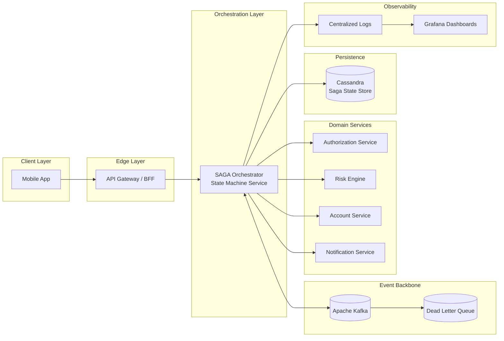
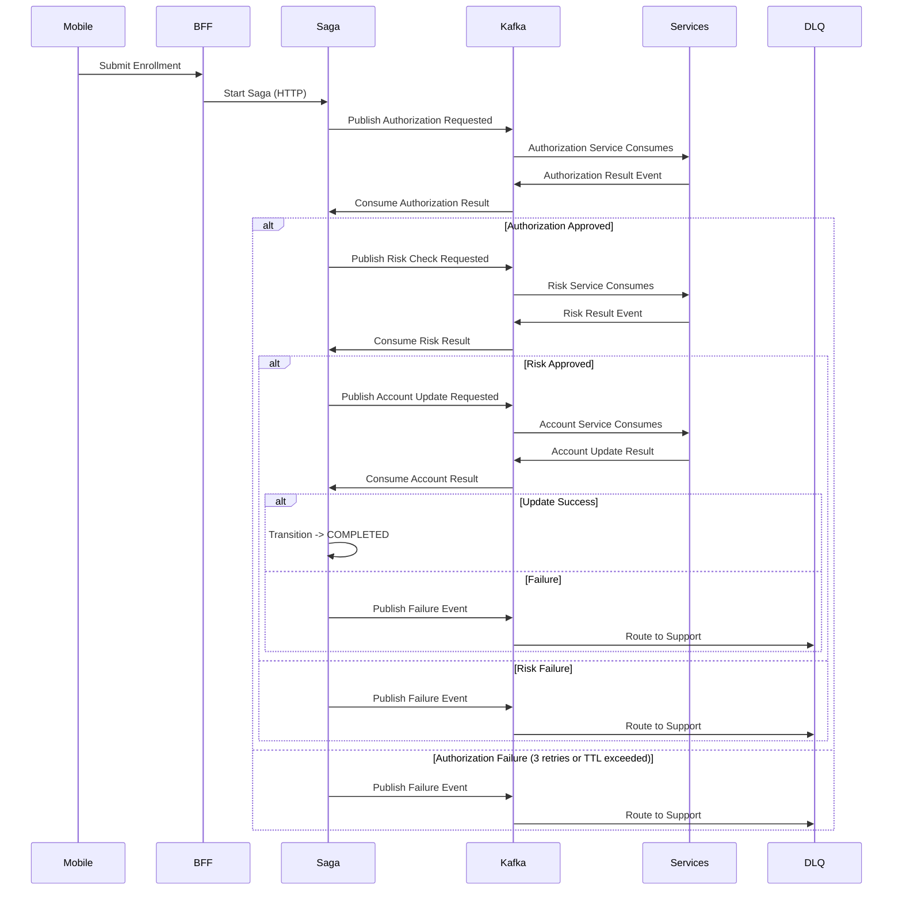

### Resumen Ejecutivo

Diseñé y entregué un servicio de orquestación distribuido basado en SAGA que permitió a los clientes contratar el producto de descubierto (“Cheque Especial”) directamente por canales móviles, sustituyendo una ruta de alta más dependiente de sucursal/manual por un flujo digital orientado a eventos.

El servicio coordinó múltiples dominios bancarios — incluyendo autorización, evaluación de riesgo, actualización de cuenta y notificación al cliente — preservando consistencia eventual, recuperabilidad operativa y auditabilidad en un entorno financiero regulado. Cada alta se modeló como un flujo determinista en máquina de estados, con snapshots de estado persistidos en Cassandra y coordinación asíncrona entre dominios mediante Kafka.

El objetivo no era solo exponer una nueva funcionalidad móvil de alta, sino crear una capa de orquestación resiliente capaz de sobrevivir a fallos parciales, eventos duplicados, reintentos downstream y handoffs manuales de soporte sin perder silenciosamente solicitudes de clientes.

### Impacto de Negocio

- Habilité un nuevo canal móvil para la contratación de descubierto, ampliando el acceso más allá de flujos en sucursal/manual o asistidos por soporte.
- Reduje la dependencia operativa de altas manuales e intervención de backoffice en recorridos estándar de clientes.
- Mejoré la adopción digital del producto al permitir que clientes elegibles completaran la contratación de descubierto directamente desde la app móvil.
- Reforcé la auditabilidad al persistir snapshots de estado de la saga y hacer rastreable cada transición del flujo.
- Mejoré la fiabilidad al aislar altas fallidas o con timeout mediante reintentos acotados, límites de TTL, enrutamiento a DLQ y escalado a soporte.
- Creé un patrón reutilizable de orquestación para flujos bancarios de larga duración que requieren consistencia eventual entre múltiples dominios backend.

### Visión General de la Arquitectura

El servicio de orquestación operaba como un motor de flujo centralizado responsable de coordinar servicios de dominio de forma asíncrona. Las solicitudes móviles entraban por la ruta de aplicación/BFF y disparaban una nueva instancia de saga; el orquestador avanzaba el flujo publicando y consumiendo eventos Kafka, persistiendo snapshots de progreso y aplicando transiciones de estado deterministas.

Infraestructura de Soporte:

- Backbone de Eventos: Apache Kafka
- Gobernanza de Esquemas: Avro + Confluent Schema Registry
- Dead Letter Queue (DLQ): flujos de alta fallidos o expirados
- Persistencia de Estado: snapshots de saga en Cassandra
- Observabilidad: logs centralizados, dashboards Grafana, consultas operativas
- Streaming Analítico: Apache Spark
- Reporting & BI: Amazon Redshift

#### Características Arquitectónicas

- Orquestación SAGA impulsada por máquina de estados para flujos financieros de larga duración
- Comunicación orientada a eventos entre el orquestador y dominios bancarios downstream
- Snapshots persistentes de saga que permiten recuperación, replay e investigación manual
- Workers orquestadores stateless para escalabilidad horizontal
- Manejo idempotente mediante garantías downstream y progresión monotónica del estado de la saga
- Estrategia de reintento acotada con aislamiento de fallos basado en TTL
- Ruta de escalado vía DLQ para equipos de soporte cuando el procesamiento automatizado no podía completarse con seguridad
- Observabilidad operativa completa mediante logs, métricas, dashboards e historial de estado consultable

### Modelo de Máquina de Estados

Cada solicitud de alta se modeló como una máquina de estados determinista con transiciones solo hacia adelante. El orquestador persistía snapshots tras transiciones relevantes para que el flujo pudiera reanudarse con seguridad tras reinicios de proceso, eventos duplicados o retrasos downstream.

#### Estados Principales

- STARTED
- AUTHORIZED
- RISK_APPROVED
- ACCOUNT_UPDATED
- NOTIFIED
- COMPLETED
- FAILED

Las transiciones de estado eran monotónicas: una vez que la saga avanzaba a un estado más nuevo, eventos obsoletos o duplicados no podían retrocederla ni sobrescribir el snapshot más avanzado.

### Diagrama de Secuencia — Alta de Descubierto Orientada a Eventos (Kafka)

### Flujo de Alta y Manejo de Fallos

1. El cliente envía una solicitud de alta de descubierto por la app móvil.
2. El móvil llama a la capa BFF/API, que crea o dispara una nueva instancia de saga.
3. El orquestador persiste el estado inicial de la saga en Cassandra.

4. Paso de Autorización
   - Solicita autorización al dominio de autorización.
   - En éxito, transiciona a `AUTHORIZED` y persiste un nuevo snapshot.
   - En fallo transitorio, reintenta dentro de límites definidos.

5. Evaluación de Riesgo
   - Solicita evaluación de elegibilidad/riesgo al dominio de riesgo.
   - En aprobación, transiciona a `RISK_APPROVED`.
   - En fallo o respuesta no disponible, reintenta solo mientras el flujo permanezca dentro del presupuesto de ejecución.

6. Actualización de Cuenta
   - Solicita actualización de cuenta/límite de descubierto al dominio de cuentas.
   - En éxito, transiciona a `ACCOUNT_UPDATED`.
   - En estado duplicado o ya procesado downstream, trata la respuesta según el snapshot actual de la saga y evita corromper el flujo.

7. Notificación
   - Envía confirmación o comunicación final al cliente.
   - Transiciona a `NOTIFIED` y luego `COMPLETED` cuando el flujo alcanza su estado terminal de éxito.

### Estrategia de Reintento y Dead Letter

- Cada paso crítico soportaba reintentos acotados, comúnmente hasta 3 intentos.
- Un time-to-live (TTL) global de aproximadamente 5 minutos acotaba la ejecución completa de la saga.
- Si los reintentos se agotaban, se excedía el TTL o el flujo alcanzaba un estado que no podía resolverse automáticamente con seguridad:
  - La alta se enrutaba a una Dead Letter Queue (DLQ).
  - El estado final y snapshots relevantes permanecían disponibles para investigación.
  - Un equipo dedicado de soporte podía procesar o reconciliar el caso manualmente.

Este diseño evitaba reintentos indefinidos y protegía sistemas downstream de tormentas de reintento, asegurando que las solicitudes de clientes nunca se perdieran silenciosamente.

### Modelo de Idempotencia y Concurrencia

El orquestador se diseñó para escalar horizontalmente sin depender de locks distribuidos en Cassandra. La seguridad provenía de la combinación de idempotencia downstream, reglas de máquina de estados y comparación de snapshots.

- Los workers orquestadores eran stateless y escalables horizontalmente.
- Mensajes duplicados o ejecución repetida de pasos podían ocurrir en condiciones normales de sistemas distribuidos.
- Se esperaba que los sistemas downstream rechazaran o manejaran con seguridad operaciones duplicadas ya procesadas.
- El orquestador evaluaba respuestas contra el snapshot actual de la saga antes de aplicar cualquier transición.
- Eventos obsoletos, respuestas retrasadas o callbacks duplicados no podían sobrescribir un estado más avanzado.

Si un sistema downstream ya había procesado una solicitud, la respuesta duplicada no corrompía la saga. El orquestador ignoraba el evento obsoleto o lo interpretaba en el contexto del snapshot persistido más reciente.

La progresión de estado era monotónica. Eventos más antiguos no podían sobrescribir un estado de saga más avanzado, lo que proporcionaba seguridad sin introducir cuellos de botella de coordinación.

### Observabilidad y Transparencia Operativa

- Logs estructurados para cada transición de saga, intento de reintento, solicitud downstream, estado de fallo y evento de enrutamiento a DLQ.
- Agregación centralizada de logs y dashboards Grafana para investigación operativa.
- Snapshots de saga consultables en Cassandra para reconstruir el historial de alta.
- Monitorización de DLQ para flujos de intervención manual.
- Métricas de tasa de éxito, volumen de reintentos, latencia por paso, tasa de timeout y concentración de fallos por dominio downstream.
- Streaming analítico hacia Apache Spark y Amazon Redshift para soportar reporting y visibilidad de negocio.

Los equipos operativos podían rastrear una alta de extremo a extremo usando logs, snapshots de estado y contexto de DLQ, reduciendo ambigüedad cuando se requería intervención de soporte.

### Diseño de Escalabilidad y Resiliencia

- Workers orquestadores stateless soportaban escalado horizontal en picos de uso móvil.
- Kafka proporcionaba coordinación orientada a eventos y capacidad de replay entre dominios.
- Snapshots de saga en Cassandra permitían recuperación tras caídas de proceso, reinicios de despliegue o respuestas downstream retrasadas.
- Esquemas Avro y Confluent Schema Registry ayudaban a mantener contratos de eventos type-safe y retrocompatibles.
- Reintentos acotados y límites de TTL evitaban fallos en cascada y ejecución indefinida de flujos.
- El enrutamiento a DLQ convertía fallos de automatización no resueltos en trabajo operativo explícito en lugar de inconsistencia oculta de datos.

---

_Asociado a Itaú Unibanco_

_Los detalles como cronogramas específicos, métricas e identificadores internos se han generalizado de acuerdo con acuerdos de confidencialidad._

---

### Stack Tecnológico

Java, Spring Boot, Spring State Machine, Apache Kafka, Avro, Confluent Schema Registry, Cassandra, Apache Spark, Amazon Redshift, Docker, JUnit, Grafana
