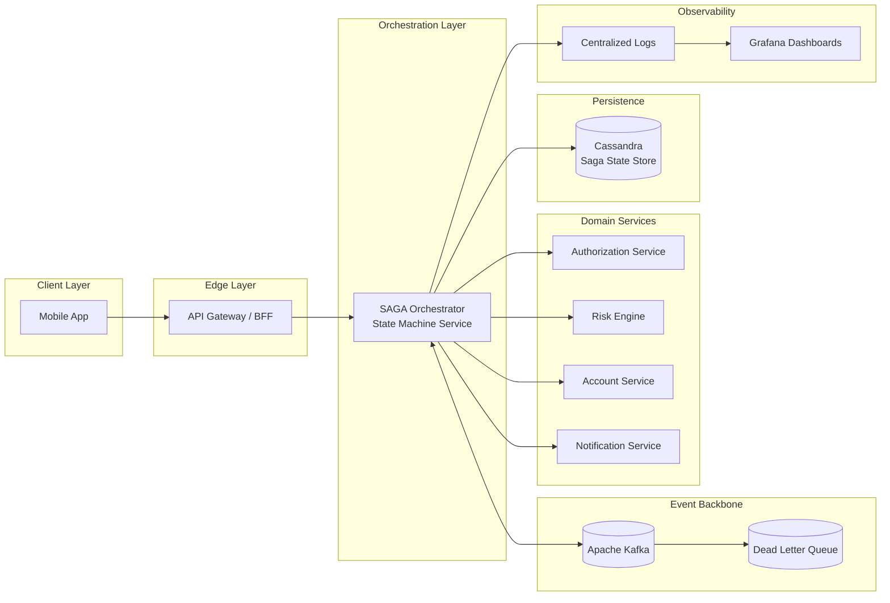
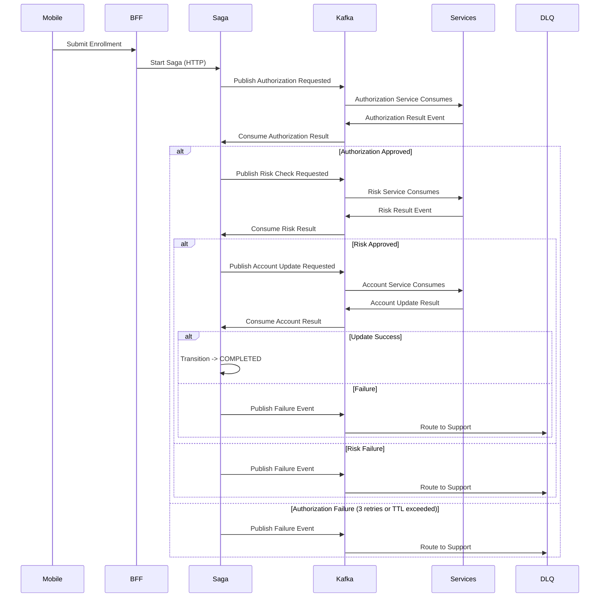

### Sintesi Esecutiva

Ho progettato e consegnato un servizio di orchestrazione distribuito basato su SAGA che ha permesso ai clienti di sottoscrivere il prodotto di scoperto (“Cheque Especial”) direttamente dai canali mobile, sostituendo un percorso di adesione più dipendente da filiale/manuale con un flusso digitale event-driven.

Il servizio ha coordinato più domini bancari — inclusi autorizzazione, valutazione del rischio, aggiornamento conto e notifica al cliente — preservando consistenza eventuale, recuperabilità operativa e auditabilità in un ambiente finanziario regolamentato. Ogni adesione è stata modellata come un flusso deterministico a macchina a stati, con snapshot di stato persistiti su Cassandra e coordinazione asincrona tra domini tramite Kafka.

L'obiettivo non era solo esporre una nuova funzionalità mobile di adesione, ma creare uno strato di orchestrazione resiliente in grado di sopravvivere a fallimenti parziali, eventi duplicati, retry downstream e handoff manuali al supporto senza perdere silenziosamente le richieste dei clienti.

### Impatto di Business

- Ho abilitato un nuovo canale mobile per l'adesione allo scoperto, ampliando l'accesso oltre flussi in filiale/manuale o assistiti dal supporto.
- Ho ridotto la dipendenza operativa da adesioni manuali e intervento backoffice nei journey standard dei clienti.
- Ho migliorato l'adozione digitale del prodotto consentendo ai clienti eleggibili di completare l'adesione allo scoperto direttamente dall'app mobile.
- Ho rafforzato l'auditabilità persistendo snapshot di stato della saga e rendendo tracciabile ogni transizione del flusso.
- Ho migliorato l'affidabilità isolando adesioni fallite o in timeout tramite retry limitati, limiti TTL, routing verso DLQ ed escalation al supporto.
- Ho creato un pattern riutilizzabile di orchestrazione per flussi bancari di lunga durata che richiedono consistenza eventuale tra più domini backend.

### Panoramica Architetturale

Il servizio di orchestrazione operava come motore di workflow centralizzato responsabile di coordinare i servizi di dominio in modo asincrono. Le richieste mobile entravano tramite il percorso applicazione/BFF e innescavano una nuova istanza di saga; l'orchestratore avanzava il flusso pubblicando e consumando eventi Kafka, persistendo snapshot di progresso e applicando transizioni di stato deterministiche.

Infrastruttura di Supporto:

- Event Backbone: Apache Kafka
- Governance degli Schema: Avro + Confluent Schema Registry
- Dead Letter Queue (DLQ): flussi di adesione falliti o scaduti
- Persistenza dello Stato: snapshot di saga su Cassandra
- Osservabilità: log centralizzati, dashboard Grafana, query operative
- Streaming Analitico: Apache Spark
- Reporting & BI: Amazon Redshift

#### Caratteristiche Architetturali

- Orchestrazione SAGA guidata da macchina a stati per flussi finanziari di lunga durata
- Comunicazione event-driven tra orchestratore e domini bancari downstream
- Snapshot persistenti di saga che abilitano recupero, replay e investigazione manuale
- Worker orchestratori stateless per scalabilità orizzontale
- Gestione idempotente tramite garanzie downstream e progressione monotona dello stato saga
- Strategia di retry limitata con isolamento dei fallimenti basato su TTL
- Percorso di escalation via DLQ per team di supporto quando il processing automatizzato non poteva completarsi in sicurezza
- Osservabilità operativa completa tramite log, metriche, dashboard e storico di stato interrogabile

### Modello a Macchina a Stati

Ogni richiesta di adesione è stata modellata come macchina a stati deterministica con transizioni solo in avanti. L'orchestratore persisteva snapshot dopo transizioni rilevanti così il flusso potesse riprendere in sicurezza dopo restart di processo, eventi duplicati o ritardi downstream.

#### Stati Principali

- STARTED
- AUTHORIZED
- RISK_APPROVED
- ACCOUNT_UPDATED
- NOTIFIED
- COMPLETED
- FAILED

Le transizioni di stato erano monotone: una volta che la saga avanzava a uno stato più recente, eventi obsoleti o duplicati non potevano farla retrocedere né sovrascrivere lo snapshot più avanzato.

### Diagramma di Sequenza — Adesione Scoperto Event-Driven (Kafka)

### Flusso di Adesione e Gestione dei Fallimenti

1. Il cliente invia una richiesta di adesione allo scoperto tramite l'app mobile.
2. Il mobile chiama il layer BFF/API, che crea o innesca una nuova istanza di saga.
3. L'orchestratore persiste lo stato iniziale della saga su Cassandra.

4. Passo di Autorizzazione
   - Richiede autorizzazione al dominio di autorizzazione.
   - In caso di successo, transiziona a `AUTHORIZED` e persiste un nuovo snapshot.
   - In caso di fallimento transitorio, ritenta entro limiti definiti.

5. Valutazione del Rischio
   - Richiede valutazione eleggibilità/rischio al dominio rischio.
   - In caso di approvazione, transiziona a `RISK_APPROVED`.
   - In caso di fallimento o risposta non disponibile, ritenta solo finché il flusso resta entro il budget di esecuzione.

6. Aggiornamento Conto
   - Richiede aggiornamento conto/limite scoperto al dominio conti.
   - In caso di successo, transiziona a `ACCOUNT_UPDATED`.
   - In caso di stato duplicato o già processato downstream, tratta la risposta secondo lo snapshot corrente della saga ed evita di corrompere il flusso.

7. Notifica
   - Invia conferma o comunicazione finale al cliente.
   - Transiziona a `NOTIFIED` e poi `COMPLETED` quando il flusso raggiunge lo stato terminale di successo.

### Strategia di Retry e Dead Letter

- Ogni passo critico supportava retry limitati, comunemente fino a 3 tentativi.
- Un time-to-live (TTL) globale di circa 5 minuti limitava l'esecuzione completa della saga.
- Se i retry si esaurivano, il TTL veniva superato o il flusso raggiungeva uno stato che non poteva essere risolto automaticamente in sicurezza:
  - L'adesione veniva instradata verso una Dead Letter Queue (DLQ).
  - Lo stato finale e gli snapshot rilevanti restavano disponibili per l'investigazione.
  - Un team di supporto dedicato poteva processare o riconciliare il caso manualmente.

Questo design evitava retry indefiniti e proteggeva i sistemi downstream da tempeste di retry, assicurando che le richieste dei clienti non venissero mai perse silenziosamente.

### Modello di Idempotenza e Concorrenza

L'orchestratore è stato progettato per scalare orizzontalmente senza dipendere da lock distribuiti su Cassandra. La sicurezza derivava dalla combinazione di idempotenza downstream, regole della macchina a stati e confronto degli snapshot.

- I worker orchestratori erano stateless e scalabili orizzontalmente.
- Messaggi duplicati o esecuzione ripetuta di passi potevano verificarsi in condizioni normali di sistemi distribuiti.
- I sistemi downstream erano attesi per rifiutare o gestire in sicurezza operazioni duplicate già processate.
- L'orchestratore valutava le risposte rispetto allo snapshot corrente della saga prima di applicare qualsiasi transizione.
- Eventi obsoleti, risposte ritardate o callback duplicati non potevano sovrascrivere uno stato più avanzato.

Se un sistema downstream aveva già processato una richiesta, la risposta duplicata non corrompeva la saga. L'orchestratore ignorava l'evento obsoleto o lo interpretava nel contesto dello snapshot persistito più recente.

La progressione di stato era monotona. Eventi più vecchi non potevano sovrascrivere uno stato saga più avanzato, fornendo sicurezza senza introdurre colli di bottiglia di coordinazione.

### Osservabilità e Trasparenza Operativa

- Log strutturati per ogni transizione di saga, tentativo di retry, richiesta downstream, stato di fallimento ed evento di routing verso DLQ.
- Aggregazione centralizzata dei log e dashboard Grafana per investigazione operativa.
- Snapshot di saga interrogabili su Cassandra per ricostruire la cronologia di adesione.
- Monitoraggio DLQ per flussi di intervento manuale.
- Metriche su tasso di successo, volume retry, latenza per passo, tasso di timeout e concentrazione fallimenti per dominio downstream.
- Streaming analitico verso Apache Spark e Amazon Redshift per supportare reporting e visibilità di business.

I team operativi potevano tracciare un'adesione end-to-end usando log, snapshot di stato e contesto DLQ, riducendo l'ambiguità quando era richiesto intervento del supporto.

### Design di Scalabilità e Resilienza

- Worker orchestratori stateless supportavano scaling orizzontale nei picchi di utilizzo mobile.
- Kafka forniva coordinazione event-driven e capacità di replay tra domini.
- Snapshot di saga su Cassandra abilitavano recupero dopo crash di processo, restart di deploy o risposte downstream ritardate.
- Schema Avro e Confluent Schema Registry aiutavano a mantenere contratti evento type-safe e retrocompatibili.
- Retry limitati e limiti TTL prevenivano fallimenti a cascata ed esecuzione indefinita dei flussi.
- Il routing verso DLQ convertiva fallimenti di automazione irrisolti in lavoro operativo esplicito invece di inconsistenza nascosta dei dati.

---

_Associato a Itaú Unibanco_

_Dettagli come tempistiche specifiche, metriche e identificatori interni sono stati generalizzati in conformità con accordi di riservatezza._

---

### Stack Tecnologico

Java, Spring Boot, Spring State Machine, Apache Kafka, Avro, Confluent Schema Registry, Cassandra, Apache Spark, Amazon Redshift, Docker, JUnit, Grafana
